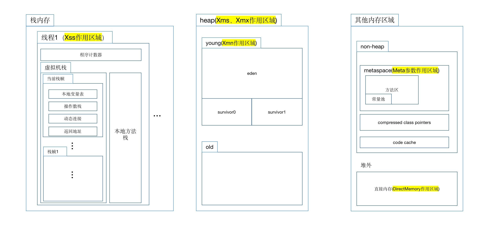

## 第一次课

### 1、自己写一个简单的 Hello.java，里面需要涉及基本类型，四则运行，if 和 for，然后自己分析一下对应的字节码
见[Work01.md](Work01.md)

### 2、自定义一个 Classloader，加载一个 Hello.xlass 文件，执行 hello 方法，此文件内 容是一个 Hello.class 文件所有字节(x=255-x)处理后的文件。文件群里提供。
见[自定义类加载器](XClassLoader.java)

### 3、画一张图，展示 Xmx、Xms、Xmn、Meta、DirectMemory、Xss 这些内存参数的 关系。


### 4、检查一下自己维护的业务系统的 JVM 参数配置，用 jstat 和 jstack、jmap

### 查看一下详情，并且自己独立分析一下大概情况，思考有没有不合理的地方，如何改进。
注意：
1、对于线上有流量的系统，慎重使用jmap命令。
2、如果没有线上系统，可以自己 run 一个 web/java 项目。或者直接查看idea进程。  

#### 线上没有权限，所以选择了开发和测试环境的服务做实验。分别用jinfo查看了进程的所有参数、jmap查看了


####  jps

* jps -v

```
root@k8s-node9:/# jps -v
9 jar -javaagent:/root/sandbox/lib/jacocoagent.jar=includes=*,output=tcpserver,port=29807,address=*
25017 Jps -Dapplication.home=/usr/local/openjdk-8 -Xms8m
```

#### jmap

* jmap -heap 9 

  ```
  root@k8s-node9:/# jmap -heap 9
  Attaching to process ID 9, please wait...
  Debugger attached successfully.
  Server compiler detected.
  JVM version is 25.252-b09
  
  using thread-local object allocation.
  Parallel GC with 8 thread(s)   //使用并行GC 8个GC线程 
  
  Heap Configuration:
     MinHeapFreeRatio         = 0    
     MaxHeapFreeRatio         = 100    
     MaxHeapSize              = 2147483648 (2048.0MB) 最大堆内存
     NewSize                  = 44564480 (42.5MB)     年轻代初始值
     MaxNewSize               = 715653120 (682.5MB)	年轻代最大值
     OldSize                  = 89653248 (85.5MB)		年老代最大值
     NewRatio                 = 2						年老代:年轻代
     SurvivorRatio            = 8						eden：s0
     MetaspaceSize            = 21807104 (20.796875MB)	metaspace初始值
     CompressedClassSpaceSize = 1073741824 (1024.0MB)		压缩类空间大小
     MaxMetaspaceSize         = 17592186044415 MB			metaspace最大值
     G1HeapRegionSize         = 0 (0.0MB)
  
  Heap Usage:
  PS Young Generation
  Eden Space:
     capacity = 41943040 (40.0MB)
     used     = 16902584 (16.11956024169922MB)
     free     = 25040456 (23.88043975830078MB)
     40.29890060424805% used
  From Space:
     capacity = 1048576 (1.0MB)
     used     = 1015936 (0.9688720703125MB)
     free     = 32640 (0.0311279296875MB)
     96.88720703125% used
  To Space:
     capacity = 2097152 (2.0MB)
     used     = 0 (0.0MB)
     free     = 2097152 (2.0MB)
     0.0% used
  PS Old Generation
     capacity = 164102144 (156.5MB)
     used     = 138620920 (132.19921112060547MB)
     free     = 25481224 (24.30078887939453MB)
     84.47233937418879% used
  
  61848 interned Strings occupying 7318168 bytes.		当前字符串常量池大小
  ```

* jmap -histo 9

  部分内容：

```
10756:             1             16  sun.text.normalizer.NormalizerImpl$AuxTrieImpl
10757:             1             16  sun.text.normalizer.NormalizerImpl$FCDTrieImpl
10758:             1             16  sun.text.normalizer.NormalizerImpl$NormTrieImpl
10759:             1             16  sun.util.calendar.Gregorian
10760:             1             16  sun.util.calendar.JulianCalendar
10761:             1             16  sun.util.locale.InternalLocaleBuilder$CaseInsensitiveChar
10762:             1             16  sun.util.locale.provider.AuxLocaleProviderAdapter$NullProvider
10763:             1             16  sun.util.locale.provider.CalendarDataUtility$CalendarWeekParameterGetter
10764:             1             16  sun.util.locale.provider.SPILocaleProviderAdapter
10765:             1             16  sun.util.locale.provider.TimeZoneNameUtility$TimeZoneNameGetter
10766:             1             16  sun.util.resources.LocaleData
10767:             1             16  sun.util.resources.LocaleData$LocaleDataResourceBundleControl
Total       3195116      163983512
```

* jmap -dump xx xxx

  导出堆栈日志

#### jinfo 

* jinfo 9 

```
Attaching to process ID 9, please wait...
Debugger attached successfully.
Server compiler detected.
JVM version is 25.252-b09
Java System Properties:

java.runtime.name = OpenJDK Runtime Environment
java.vm.version = 25.252-b09
sun.boot.library.path = /usr/local/openjdk-8/jre/lib/amd64
java.protocol.handler.pkgs = org.springframework.boot.loader
java.vendor.url = http://java.oracle.com/
java.vm.vendor = Oracle Corporation
path.separator = :
file.encoding.pkg = sun.io
java.vm.name = OpenJDK 64-Bit Server VM
sun.os.patch.level = unknown
sun.java.launcher = SUN_STANDARD
user.dir = /
java.vm.specification.name = Java Virtual Machine Specification
PID = 9
cat-client-config = <?xml version="1.0" encoding="utf-8"?>
<config mode="client" enabled="true" domain="10201-pica-cloud-content" max-message-size="5000">
   <servers>
      <server ip="192.168.120.65" port="2280" http-port="8080" enabled="true"/>
      <server ip="192.168.120.66" port="2280" http-port="8080" enabled="true"/>
   </servers>
</config>

java.runtime.version = 1.8.0_252-b09
java.awt.graphicsenv = sun.awt.X11GraphicsEnvironment
os.arch = amd64
java.endorsed.dirs = /usr/local/openjdk-8/jre/lib/endorsed
org.jboss.logging.provider = slf4j
line.separator = 

java.io.tmpdir = /tmp
java.vm.specification.vendor = Oracle Corporation
os.name = Linux
sun.jnu.encoding = UTF-8
java.library.path = /usr/java/packages/lib/amd64:/usr/lib64:/lib64:/lib:/usr/lib
spring.beaninfo.ignore = true
sun.nio.ch.bugLevel = 
java.class.version = 52.0
java.specification.name = Java Platform API Specification
java.net.preferIPv4Stack = true
sun.management.compiler = HotSpot 64-Bit Tiered Compilers
os.version = 4.4.241-1.el7.elrepo.x86_64
LOG_FILE = /opt/tomcat-log/10201-pica-cloud-content/spring.log
user.home = /root
user.timezone = Asia/Shanghai
catalina.useNaming = false
java.awt.printerjob = sun.print.PSPrinterJob
file.encoding = UTF-8
@appId = 10201-pica-cloud-content
java.specification.version = 1.8
catalina.home = /tmp/tomcat.9134457504439676444.10201
user.name = root
java.class.path = pica-cloud-content.jar:/root/sandbox/lib/jacocoagent.jar
java.vm.specification.version = 1.8
sun.arch.data.model = 64
sun.java.command = pica-cloud-content.jar --spring.profiles.active=test1
java.home = /usr/local/openjdk-8/jre
user.language = en
java.specification.vendor = Oracle Corporation
awt.toolkit = sun.awt.X11.XToolkit
java.vm.info = mixed mode
java.version = 1.8.0_252
java.ext.dirs = /usr/local/openjdk-8/jre/lib/ext:/usr/java/packages/lib/ext
sun.boot.class.path = /usr/local/openjdk-8/jre/lib/resources.jar:/usr/local/openjdk-8/jre/lib/rt.jar:/usr/local/openjdk-8/jre/lib/sunrsasign.jar:/usr/local/openjdk-8/jre/lib/jsse.jar:/usr/local/openjdk-8/jre/lib/jce.jar:/usr/local/openjdk-8/jre/lib/charsets.jar:/usr/local/openjdk-8/jre/lib/jfr.jar:/usr/local/openjdk-8/jre/classes
java.awt.headless = true
java.vendor = Oracle Corporation
catalina.base = /tmp/tomcat.9134457504439676444.10201
file.separator = /
java.vendor.url.bug = http://bugreport.sun.com/bugreport/
sun.io.unicode.encoding = UnicodeLittle
sun.cpu.endian = little
LOG_PATH = /opt/tomcat-log/10201-pica-cloud-content
sun.cpu.isalist = 

VM Flags:
Non-default VM flags: -XX:CICompilerCount=4 -XX:InitialHeapSize=134217728 -XX:MaxHeapSize=2147483648 -XX:MaxNewSize=715653120 -XX:MinHeapDeltaBytes=524288 -XX:NewSize=44564480 -XX:OldSize=89653248 -XX:+UseCompressedClassPointers -XX:+UseCompressedOops -XX:+UseParallelGC 
Command line:  -javaagent:/root/sandbox/lib/jacocoagent.jar=includes=*,output=tcpserver,port=29807,address=*
```

#### jstack 

* jstack 9

```
"C2 CompilerThread2" #9 daemon prio=9 os_prio=0 tid=0x00007f06dc322000 nid=0x25 waiting on condition [0x0000000000000000]
   java.lang.Thread.State: RUNNABLE

"C2 CompilerThread1" #8 daemon prio=9 os_prio=0 tid=0x00007f06dc2be000 nid=0x24 waiting on condition [0x0000000000000000]
   java.lang.Thread.State: RUNNABLE

"C2 CompilerThread0" #7 daemon prio=9 os_prio=0 tid=0x00007f06dc300000 nid=0x23 waiting on condition [0x0000000000000000]
   java.lang.Thread.State: RUNNABLE

"org.jacoco.agent.rt.internal_9393af1.output.TcpServerOutput" #5 daemon prio=5 os_prio=0 tid=0x00007f06dc2a9800 nid=0x22 runnable [0x00007f06aee53000]
   java.lang.Thread.State: RUNNABLE
        at java.net.PlainSocketImpl.socketAccept(Native Method)
        at java.net.AbstractPlainSocketImpl.accept(AbstractPlainSocketImpl.java:409)
        at java.net.ServerSocket.implAccept(ServerSocket.java:560)
        at java.net.ServerSocket.accept(ServerSocket.java:528)
        at org.jacoco.agent.rt.internal_9393af1.output.TcpServerOutput$1.run(TcpServerOutput.java:59)
        - locked <0x0000000080010380> (a java.net.ServerSocket)
        at java.lang.Thread.run(Thread.java:748)

"Signal Dispatcher" #4 daemon prio=9 os_prio=0 tid=0x00007f06dc207800 nid=0x21 runnable [0x0000000000000000]
   java.lang.Thread.State: RUNNABLE

"Finalizer" #3 daemon prio=8 os_prio=0 tid=0x00007f06dc1d6000 nid=0x20 in Object.wait() [0x00007f06af5f4000]
   java.lang.Thread.State: WAITING (on object monitor)
        at java.lang.Object.wait(Native Method)
        at java.lang.ref.ReferenceQueue.remove(ReferenceQueue.java:144)
        - locked <0x000000008000ed90> (a java.lang.ref.ReferenceQueue$Lock)
        at java.lang.ref.ReferenceQueue.remove(ReferenceQueue.java:165)
        at java.lang.ref.Finalizer$FinalizerThread.run(Finalizer.java:216)

"Reference Handler" #2 daemon prio=10 os_prio=0 tid=0x00007f06dc1d1800 nid=0x1f in Object.wait() [0x00007f06af6f5000]
   java.lang.Thread.State: WAITING (on object monitor)
        at java.lang.Object.wait(Native Method)
        at java.lang.Object.wait(Object.java:502)
        at java.lang.ref.Reference.tryHandlePending(Reference.java:191)
        - locked <0x0000000080011388> (a java.lang.ref.Reference$Lock)
        at java.lang.ref.Reference$ReferenceHandler.run(Reference.java:153)

"VM Thread" os_prio=0 tid=0x00007f06dc1c7800 nid=0x1e runnable 

"GC task thread#0 (ParallelGC)" os_prio=0 tid=0x00007f06dc020800 nid=0xb runnable 

"GC task thread#1 (ParallelGC)" os_prio=0 tid=0x00007f06dc022000 nid=0xc runnable 

"GC task thread#2 (ParallelGC)" os_prio=0 tid=0x00007f06dc024000 nid=0xd runnable 

"GC task thread#3 (ParallelGC)" os_prio=0 tid=0x00007f06dc025800 nid=0xe runnable 

"GC task thread#4 (ParallelGC)" os_prio=0 tid=0x00007f06dc027800 nid=0xf runnable 

"GC task thread#5 (ParallelGC)" os_prio=0 tid=0x00007f06dc029000 nid=0x10 runnable 

"GC task thread#6 (ParallelGC)" os_prio=0 tid=0x00007f06dc02b000 nid=0x11 runnable 

"GC task thread#7 (ParallelGC)" os_prio=0 tid=0x00007f06dc02c800 nid=0x12 runnable 

"VM Periodic Task Thread" os_prio=0 tid=0x00007f06dc33b800 nid=0x28 waiting on condition 

JNI global references: 633
```


#### jstat

* jstat -gc 9 1000 1000 

  打印出各个内存容量和占用情况，每秒输出一次，输出1000次。

```
root@k8s-node9:/# jstat -gc 9 1000 1000
 S0C    S1C    S0U    S1U      EC       EU        OC         OU       MC     MU    CCSC   CCSU   YGC     YGCT    FGC    FGCT     GCT   
1536.0 1024.0  0.0   672.0  34816.0   6309.0   156160.0   138780.5  148952.0 138636.1 15360.0 13655.9 280857 1645.735 5007   924.155 2569.890
1024.0 1536.0 767.6   0.0   34304.0   8828.8   156160.0   139292.5  148952.0 138636.1 15360.0 13655.9 280858 1645.740 5007   924.155 2569.895
1024.0 1536.0 384.0   0.0   40448.0  24656.3   156160.0   140828.5  148952.0 138636.1 15360.0 13655.9 280860 1645.749 5007   924.155 2569.904
```

这里可以看出gc一共花费了2569秒，根据**jcmd 9 VM.uptime**查询系统运行了955919.950 s。11天。考虑到测试环境没什么访问量，fullgc是有点多的。这里显示堆内存只有不到200m就一直fullGC，

free -m显示服务器内存情况,-m代表单位为mb：

```
root@k8s-node9:/# free -m
              total        used        free      shared  buff/cache   available
Mem:          64429       18630        2432          37       43365       45280
Swap:             0           0           0
```

可以看出服务器可用内存还有45gb。

而**jmap -heap显示最大堆内存为2G**，由于服务器使用的是k8s，猜测是当前服务的容器内存设置的比较小，所以堆内存无法继续扩容。

* jstat -gcutil 9 1000 1000

```
root@k8s-node9:/# jstat -gcutil 9 1000 1000
  S0     S1     E      O      M     CCS    YGC     YGCT    FGC    FGCT     GCT   
 59.38   0.00  87.06  83.46  93.07  88.91 281024 1646.729  5011  924.875 2571.604
100.00   0.00  11.79  84.10  93.07  88.91 281026 1646.739  5011  924.875 2571.614
```

#### jcmd

* jcmd 9 help

  显示当前进程可查询的参数

```
root@k8s-node9:/# jcmd -h
Usage: jcmd <pid | main class> <command ...|PerfCounter.print|-f file>
   or: jcmd -l                                                    
   or: jcmd -h                                                    
                                                                  
  command must be a valid jcmd command for the selected jvm.      
  Use the command "help" to see which commands are available.   
  If the pid is 0, commands will be sent to all Java processes.   
  The main class argument will be used to match (either partially 
  or fully) the class used to start Java.                         
  If no options are given, lists Java processes (same as -p).     
                                                                  
  PerfCounter.print display the counters exposed by this process  
  -f  read and execute commands from the file                     
  -l  list JVM processes on the local machine                     
  -h  this help                                                   
root@k8s-node9:/# jcmd 9 help
9:
The following commands are available:
VM.native_memory
ManagementAgent.stop
ManagementAgent.start_local
ManagementAgent.start
VM.classloader_stats
GC.rotate_log
Thread.print
GC.class_stats
GC.class_histogram
GC.heap_dump
GC.finalizer_info
GC.heap_info
GC.run_finalization
GC.run
VM.uptime
VM.dynlibs
VM.flags
VM.system_properties
VM.command_line
VM.version
help
```

* jcmd 9 VM.uptime

  进程运行时间

* jcmd 9 GC.heap_info

  查看当前进程内存占用信息

```
root@k8s-node9:/# jcmd 9 GC.heap_info
9:
 PSYoungGen      total 40960K, used 25395K [0x00000000d5580000, 0x00000000d8400000, 0x0000000100000000)
  eden space 39424K, 63% used [0x00000000d5580000,0x00000000d6dfcd90,0x00000000d7c00000)
  from space 1536K, 20% used [0x00000000d8100000,0x00000000d8150010,0x00000000d8280000)
  to   space 1536K, 0% used [0x00000000d8280000,0x00000000d8280000,0x00000000d8400000)
 ParOldGen       total 159232K, used 134503K [0x0000000080000000, 0x0000000089b80000, 0x00000000d5580000)
  object space 159232K, 84% used [0x0000000080000000,0x0000000088359d18,0x0000000089b80000)
 Metaspace       used 138636K, capacity 148638K, committed 148952K, reserved 1183744K
  class space    used 13655K, capacity 15296K, committed 15360K, reserved 1048576K
```

#### 操作系统命令 free 

* free -m

显示服务器内存情况,-m代表单位为mb：

```
root@k8s-node9:/# free -m
              total        used        free      shared  buff/cache   available
Mem:          64429       18630        2432          37       43365       45280
Swap:             0           0           0
```


