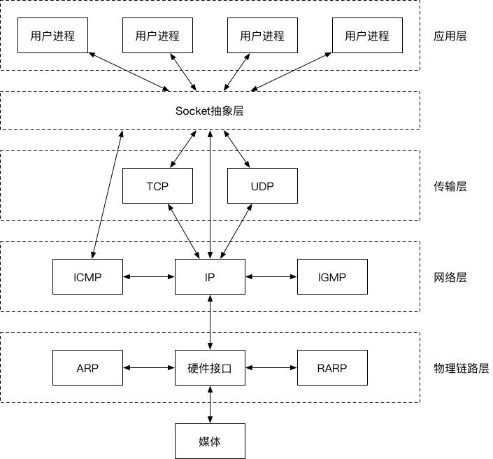

##  1、Java Socket 编程*:如何基于 Socket 实现 Server 

### 服务器通信原理


###  什么是Socket？

Socket的中文翻译过来就是“套接字”。套接字是什么，我们先来看看它的英文含义：插座。

Socket就像一个电话插座，负责连通两端的电话，进行点对点通信，让电话可以进行通信，端口就像插座上的孔，端口不能同时被其他进程占用。而我们建立连接就像把插头插在这个插座上，创建一个Socket实例开始监听后，这个电话插座就时刻监听着消息的传入，谁拨通我这个“IP地址和端口”，我就接通谁。

**实际上，Socket是在应用层和传输层之间的一个抽象层，它把TCP/IP层复杂的操作抽象为几个简单的接口，供应用层调用实现进程在网络中的通信。**Socket起源于UNIX，在Unix一切皆文件的思想下，进程间通信就被冠名为文件描述符（file desciptor），Socket是一种“打开—读/写—关闭”模式的实现，服务器和客户端各自维护一个“文件”，在建立连接打开后，可以向文件写入内容供对方读取或者读取对方内容，通讯结束时关闭文件。

另外我们经常说到的Socket所在位置如下图：



### java使用socket实现简单的HTTP服务器

* 单线程

```java
public class HttpServer01 {
    public static void main(String[] args) throws IOException{
        ServerSocket serverSocket = new ServerSocket(8801);
        while (true) {
            try {
                Socket socket = serverSocket.accept();
                service(socket);
            } catch (IOException e) {
                e.printStackTrace();
            }
        }
    }
    
    private static void service(Socket socket) {
        try {
//            Thread.sleep(5);
            PrintWriter printWriter = new PrintWriter(socket.getOutputStream(), true);
            printWriter.println("HTTP/1.1 200 OK");
            printWriter.println("Content-Type:text/html;charset=utf-8");
            String body = "hello,nio";
            printWriter.println("Content-Length:" + body.getBytes().length);
            printWriter.println();
            printWriter.write(body);
            printWriter.close();
            socket.close();
        } catch (IOException e) { // | InterruptedException e) {
            e.printStackTrace();
        }
    }
}
```

* 多线程

```java
public static void main(String[] args) throws IOException{
  ServerSocket serverSocket = new ServerSocket(8802);
  while (true) {
    try {
      final Socket socket = serverSocket.accept();
      new Thread(() -> {
        service(socket);
      }).start();
    } catch (IOException e) {
      e.printStackTrace();
    }
  }
}
```


* 多线程-线程池

```java
public static void main(String[] args) throws IOException{

  ExecutorService executorService = Executors.newFixedThreadPool(
    Runtime.getRuntime().availableProcessors() + 2);
  final ServerSocket serverSocket = new ServerSocket(8803);
  while (true) {
    try {
      final Socket socket = serverSocket.accept();
      executorService.execute(() -> service(socket));
    } catch (IOException e) {
      e.printStackTrace();
    }
  }
}
```

​	分别用wrk压测，对比三种实现，单线程只能串行处理，多线程多出了线程创建、删除的开销，，线程池最好。

## 2、 深入讨论 IO**:Server 处理时到底发生了什么

### 服务通信过程分析

上面的socket的例子，请求过程中，存在两种类型操作:
* CPU 计算/业务处理（业务处理）

- IO 操作与等待/网络、磁盘、数据库（查询db、response）

#### 1) 网络请求层面：为什么使用线程池比单线程速度快？

因为CPU比IO快很多个数量级，在每个response过程中时，CPU是可以同时执行其他的线程的网络请求。而且多个CPU可以并行工作。


对于一个 IO 相关应用来说，
例如通过网络访问，服务器端读取本 地文件，再返回给客户端(如上图)。
这种情况下，大部分 CPU 等资源，可能就被浪费了。怎么优化呢?


#### 2)    操作系统层面

不仅面临线程 /CPU 的问题，还要面对数据来回复制的问题。网络中的数据通过网卡，会先传到内核空间的数据缓冲区。然后用户进程的数据缓冲区需要从内核缓冲区中拷贝数据后才能使用数据。


这个一来，对每个业务处理过程，使用一个线程以一竿子通到底的方式， 性能不是最优的，还有提升空间。

考虑一下，理想状态，是什么样的?

流水线。

（我的理解，优化掉用户缓冲区与内核缓冲区的拷贝。让用户进程可以直接操作内核缓冲区。

## 3、 IO 模型与相关概念*:怎么理解 NIO

### 通信模型

* 阻塞、非阻塞：线程阻塞的概念
* 同步、异步：

### 五种IO模型


### BIO


### NIO

### IO 多路复用

### 信号驱动IO

### AIO


## 4、 Netty 框架简介:什么是 Netty


## 5、 Netty 使用示例*:如何使用 Netty 实现 NIO 

