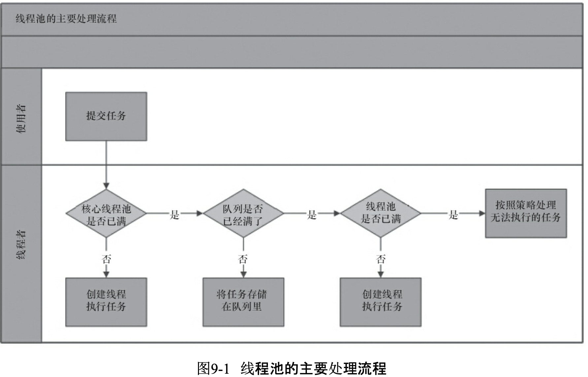

## 多线程基础

### 为什么会有多线程？


* 应用程序为单进程，如何充分利用多核CPU，让这个进程运行速度更快？
* CPU与内存、磁盘等多级缓存之有性能差距过大，利用多线程充分利用CPU资源。

* 单CPU如何让多个进程在人类看起来是在同时运行：多线程

进程是CPU分配资源的单元，线程是CPU运行的调度单元。

摩尔定律失效的原因：量子效应对原子级大小的芯片有性能影响。


## 并发编程的挑战

### 上下文切换的性能损耗

CPU通过时间片分配算法切换执行各个线程的程序，但是在线程之间切换时需要保存上一个任务的状态，以便下次切换回这个线程时，可以继续之间的任务状态。这就是上下文切换。**线程的创建和上下文切换影响的执行效率。**

#### 解决办法：

​	无锁并发编程、CAS、使用最少的线程、协程

#### 示例：通过减少waiting线程，减少上下文切换次数

```
# 导出stack dump
jstack pid > file

#查看总线程数
 wfy@wfy0828  ~/work/workspace/JAVA-01/Week_01   main ●  grep "Thread.State" stackDump | wc -l
      77
#查询各种类型的线程数
 wfy@wfy0828  ~/work/workspace/JAVA-01/Week_01   main ●  grep "java.lang.Thread.State" stackDump| awk '{$2$3$4$5}' | sort | uniq -c
 wfy@wfy0828  ~/work/workspace/JAVA-01/Week_01   main ●  grep "java.lang.Thread.State" stackDump| awk '{print$2$3$4$5}' | sort | uniq -c
  29 RUNNABLE
   5 TIMED_WAITING(onobjectmonitor)
  10 TIMED_WAITING(parking)
   1 TIMED_WAITING(sleeping)
  11 WAITING(onobjectmonitor)
  21 WAITING(parking)
```


### 死锁导致的程序非正常终止

#### 避免死锁的方法

* 避免一个线程同时获取多个锁
* 避免一个线程在锁内同时占用多个资源，尽量一个锁只占一个资源
* 尝试使用定时锁，使用lock.tryLock(timeout)替代使用内部锁机制
* 对于数据库锁，加锁和解锁必须在一个数据库连接里，否则会出现解锁失败的情况。


### 资源限制的挑战

硬件资源限制：带宽的上传和下载速度、硬盘读写速度、CPU速度

软件资源限制：：数据库连接数和socket连接数

#### 解决办法

* 硬件：服务器集群
* 软件：连接池复用

​	

## 第二章 java并发编程底层实现原理


### volatile


>分析volatile字节码：https://blog.csdn.net/a7980718/article/details/83932123
>
>使用hsdis与jitwatch查看JIT后的汇编码：https://www.jianshu.com/p/78f71c033fae
>
>备注：待实践验证


## Java 多线程*

#### 线程优先级Priority 

范围1-10。

CPU分配的每个时间片大约几十ms。Priority越大，分到的时间片越多。

但是有的操作系统可能会忽略此参数。

#### 线程状态

new：Thread类被创建

Runnable:对应操作系统中的就绪和运行状态

blocked：线程阻塞与锁

waiting：线程等待状态。等待其他线程的通知

timed_waiting:超时等待状态。超时后自动返回就绪状态。

terminated：线程执行完毕

> 注意：sleep和wait都是timed_waiting


#### 守护线程

用途：程序后台调度和支持性工作

>  JVM退出时daemon线程的finally不一定执行，所以不能使用守护线程做资源释放相关的工作。

#### 线程的创建

参考Thread构造方法：

​	一个新构造的线程对象是由其parent线程来进行空间分配的，而child线程 继承了parent是否为Daemon、优先级和加载资源的contextClassLoader以及可继承的 ThreadLocal，同时还会分配一个唯一的ID来标识这个child线程。至此，一个能够运行的线程对象就初始化好了，在堆内存中等待着运行。此时这个java线程还和操作系统线程没有关系。

#### 线程启动

调用start();

线程start()方法的含义 是:当前线程(即parent线程)同步告知Java虚拟机，只要线程规划器空闲，应立即启动调用 start()方法的线程。

#### 线程中断

interupt

#### 过期的suspend、resume和stop方法(暂停、恢复、停止)

过期的原因：suspend暂停不会释放锁等资源。stop没有给线程释放资源的时间。

#### 安全的终止线程

利用interupt方法或者boolean字段控制

#### 线程通信

线程为什么需要通信？一个慢接口中的不同业务功能可以分工给多个线程共同完成，单核利用IO阻塞时的CPU时间片或者多核服务器提供并行多线程处理，可以极大提高接口性能，但是多个线程在运行时，避免不了要使用同样的资源，或者有业务相互依赖关系，所以需要相互通信建立依赖关系。

* 等待通知机制
* 管道流：PipedOutputStream、PipedInputStream、PipedReader和PipedWriter

>PipedWriter out = new PipedWriter();
>PipedReader in = new PipedReader();
>// 将输出流和输入流进行连接，否则在使用时会抛出IOException 
>
>out.connect(in);

#### join

示例

```
public static void main(String[] args) {
        Runnable target = new Runnable() {
            @Override
            public void run() {
                for (int i = 0; i < 10; i++) {
                    System.out.println(i);
                    try {
                        TimeUnit.SECONDS.sleep(1);
                    } catch (InterruptedException e) {
                        e.printStackTrace();
                    }
                }
            }
        };
        Thread t1 = new Thread(target);
        t1.start();
        try {
            t1.join(3000);
        } catch (InterruptedException e) {
            e.printStackTrace();
        }
        System.out.println("main");
    }
```

作用：main线程中调用t1.join()或t1.join(3000)。会让主线程阻塞，直到t1线程运行后终结或join超过3s。


>join如何实现的？线程是如何被阻塞的？又是通过什么方法唤醒的呢？先来看看Thread.join方法做了什么事情
>
>```java
>public class Thread implements Runnable {
>    ...
>    public final void join() throws InterruptedException {
>        join(0);
>    }
>    ...
>    public final synchronized void join(long millis) throws InterruptedException {
>        long base = System.currentTimeMillis();
>        long now = 0;
>        if (millis < 0) {
>            throw new IllegalArgumentException("timeout value is negative");
>        }
>        if (millis == 0) { //判断是否携带阻塞的超时时间，等于0表示没有设置超时时间
>            while (isAlive()) {//isAlive获取线程状态，无线等待直到previousThread线程结束
>                wait(0); //调用Object中的wait方法实现线程的阻塞
>            }
>        } else { //阻塞直到超时
>            while (isAlive()) { 
>                long delay = millis - now;
>                if (delay <= 0) {
>                    break;
>                }
>                wait(delay);
>                now = System.currentTimeMillis() - base;
>            }
>        }
>    }
>    ...
>```
>
>从join方法的源码来看，join方法的本质调用的是Object中的wait方法实现线程的阻塞，wait方法的实现原理我们在后续的文章再说详细阐述。**但是我们需要知道的是，调用wait方法必须要获取锁**，所以join方法是被synchronized修饰的，synchronized修饰在方法层面相当于synchronized(this),this就是previousThread本身的实例。
>
>有很多人不理解join为什么阻塞的是主线程呢? 不理解的原因是阻塞主线程的方法是放在previousThread这个实例作用，让大家误以为应该阻塞previousThread线程。实际上主线程会持有previousThread这个对象的锁，然后调用wait方法去阻塞，而这个方法的调用者是在主线程中的。所以造成主线程阻塞。
>
>
>
>为什么t1结束能唤醒主线程？
>
>要了解这个问题，我们又得翻jdk的源码，但是如果大家对线程有一定的基本了解的话，通过wait方法阻塞的线程，需要通过notify或者notifyall来唤醒。所以在线程执行完毕以后会有一个唤醒的操作，只是我们不需要关心。
> 接下来在hotspot的源码中找到 thread.cpp，看看线程退出以后有没有做相关的事情来证明我们的猜想.
>
>```java
>void JavaThread::exit(bool destroy_vm, ExitType exit_type) {
>  assert(this == JavaThread::current(),  "thread consistency check");
>  ...
>  // Notify waiters on thread object. This has to be done after exit() is called
>  // on the thread (if the thread is the last thread in a daemon ThreadGroup the
>  // group should have the destroyed bit set before waiters are notified).
>  ensure_join(this); 
>  assert(!this->has_pending_exception(), "ensure_join should have cleared");
>  ...
>```
>
>观察一下 ensure_join(this)这行代码上的注释，唤醒处于等待的线程对象，这个是在线程终止之后做的清理工作，这个方法的定义代码片段如下
>
>```java
>static void ensure_join(JavaThread* thread) {
>  // We do not need to grap the Threads_lock, since we are operating on ourself.
>  Handle threadObj(thread, thread->threadObj());
>  assert(threadObj.not_null(), "java thread object must exist");
>  ObjectLocker lock(threadObj, thread);
>  // Ignore pending exception (ThreadDeath), since we are exiting anyway
>  thread->clear_pending_exception();
>  // Thread is exiting. So set thread_status field in  java.lang.Thread class to TERMINATED.
>  java_lang_Thread::set_thread_status(threadObj(), java_lang_Thread::TERMINATED);
>  // Clear the native thread instance - this makes isAlive return false and allows the join()
>  // to complete once we've done the notify_all below
>  //这里是清除native线程，这个操作会导致isAlive()方法返回false
>  java_lang_Thread::set_thread(threadObj(), NULL);
>  lock.notify_all(thread);//注意这里
>  // Ignore pending exception (ThreadDeath), since we are exiting anyway
>  thread->clear_pending_exception();
>}
>```
>
>ensure_join方法中，调用 lock.notify_all(thread); 唤醒所有等待thread锁的线程，意味着调用了join方法被阻塞的主线程会被唤醒； 到目前为止，我们基本上对join的原理做了一个比较详细的分析
>
>总结，Thread.join其实底层是通过wait/notifyall来实现线程的通信达到线程阻塞的目的；当线程执行结束以后，会触发两个事情，第一个是设置native线程对象为null、第二个是通过notifyall方法，让等待在t1对象锁上的wait方法被唤醒。

* 什么时候会使用Thread.join

在实际应用开发中，我们很少会使用thread.join。在实际使用过程中，我们可以通过join方法来等待线程执行的结果.

我们通过以下伪代码来说明join的使用场景：

```
public void joinDemo(){
   //....
   Thread t=new Thread(payService);
   t.start();
   //.... 
   //其他业务逻辑处理,不需要确定t线程是否执行完
   insertData();
   //后续的处理，需要依赖t线程的执行结果，可以在这里调用join方法等待t线程执行结束
   t.join();
}
```

10个线程每个都等前一个执行完才执行：

```
public class Join {
    public static void main(String[] args) throws Exception {
        Thread previous = Thread.currentThread();
        for (int i = 0; i < 10; i++) {
            // 每个线程拥有前一个线程的引用，需要等待前一个线程终止，才能从等待中返回
            Thread thread = new Thread(new Domino(previous), String.valueOf(i));
            thread.start();
            previous = thread;
        }
        TimeUnit.SECONDS.sleep(5);
        System.out.println(Thread.currentThread().getName() + " terminate.");
    }

    static class Domino implements Runnable {
        private Thread thread;

        public Domino(Thread thread) {
            this.thread = thread;
        }

        public void run() {
            try {
                thread.join();
            } catch (InterruptedException e) {
            }
            System.out.println(Thread.currentThread().getName() + " terminate.");
        }
    }
}
```

#### ThreadLocal 

```
public class ThreadLocalTest {
    // 第一次get()方法调用时会进行初始化(如果set方法没有调用)，每个线程会调用一次
    private static final ThreadLocal<Long> TIME_THREADLOCAL = new ThreadLocal<Long>();

    protected Long initialValue() {
        return System.currentTimeMillis();
    }

    public static final void begin() {
        TIME_THREADLOCAL.set(System.currentTimeMillis());
    }

    public static final long end() {
        return System.currentTimeMillis() - TIME_THREADLOCAL.get();
    }

    public static void main(String[] args) throws Exception {
        ThreadLocalTest.begin();
        TimeUnit.SECONDS.sleep(1);
        System.out.println("Cost: " + ThreadLocalTest.end() + " mills");
    }
}
```

Theadlocal原理：

```
//Theadlocal set源码
public void set(T value) {
        Thread t = Thread.currentThread();
        ThreadLocalMap map = getMap(t);
        if (map != null)
            map.set(this, value);
        else
            createMap(t, value);
    }
```

可以看出，每个线程都对应唯一的一个ThreadLocalMap，这里的this就是当前的Theadlocal对象，所以我可以根据线程和Theadlocal，取出放在这个线程的ThreadLocal key对应的value。对于不同的线程，虽然this都是同一个Theadlocal，但是ThreadLocalMap不同，所以做到的线程内的绑定传参数。

### volatile

### synchronized

### final

### 线程池

>线程池的优点：
>
>1、降低资源消耗。减少频繁创建销毁线程的资源开销。
>
>2、提高响应速度。响应程序处理时，线程无需创建，即时可用。
>
>3、提高线程的可管理性。可以统一调优和监控。




#### ThreadPoolExecutor

* 基本参数

  corePoolSize

  ​	核心线程数。当有一个新任务提交到线程池时，线程池会创建一个新线程执行任务。即使有其他的核心线程处于空闲也会创建，直到线程数等于核心线程数。如果调用了线程池的prestartAllCoreThreads()方法， 线程池会提前创建并启动所有基本线程。

  maximumPoolSize

  ​	最大线程数。线程池允许创建的最大线程数。如果队列满了，而且已经创建的线程数小于最大线程数，就会创建新线程执行任务。值得注意的是，如 果使用了无界的任务队列这个参数就没什么效果。

  keepAliveTime

  ​	线程活动保持时间。线程池的工作线程空闲后，保持存活的时间。所以， 如果任务很多，并且每个任务执行的时间比较短，可以调大时间，提高线程的利用率

  TimeUnit

  ​	线程活动保持时间的单位。可选的单位有天(DAYS)、小时(HOURS)、分钟 (MINUTES)、毫秒(MILLISECONDS)、微秒(MICROSECONDS，千分之一毫秒)和纳秒(NANOSECONDS，千分之一微秒)。

​		BlockingQueue

​			任务队列。用于保存等待执行的任务的阻塞队列。可以选择以下几 个阻塞队列。

​				ArrayBlockingQueue:是一个基于数组结构的有界阻塞队列，此队列按FIFO(先进先出)原则对元素进行排序。

​				LinkedBlockingQueue:一个基于链表结构的阻塞队列，此队列按FIFO排序元素，吞吐量通常要高于ArrayBlockingQueue。静态工厂方法Executors.newFixedThreadPool()使用了这个队列。
​				SynchronousQueue:一个不存储元素的阻塞队列。每个插入操作必须等到另一个线程调用 移除操作，否则插入操作一直处于阻塞状态，吞吐量通常要高于Linked-BlockingQueue，静态工厂方法Executors.newCachedThreadPool使用了这个队列。
​				PriorityBlockingQueue:一个具有优先级的无限阻塞队列。

​		ThreadFactory

​			用于设置创建线程的工厂，可以通过线程工厂给每个创建出来的线程设 置更有意义的名字。使用开源框架guava提供的ThreadFactoryBuilder可以快速给线程池里的线 程设置有意义的名字，代码如下。

```
new ThreadFactoryBuilder().setNameFormat("XX-task-%d").build();
```

​		RejectedExecutionHandler handler

​			饱和策略。当队列和线程池都满了，说明线程池处于饱和状 态，那么必须采取一种策略处理提交的新任务。这个策略默认情况下是AbortPolicy，表示无法 处理新任务时抛出异常。在JDK 1.5中Java线程池框架提供了以下4种策略。

​			AbortPolicy:直接抛出异常。
​			CallerRunsPolicy:只用调用者所在线程来运行任务。
​			DiscardOldestPolicy:丢弃队列里最近的一个任务，并执行当前任务。
​			DiscardPolicy:不处理，丢弃掉。
​			当然，也可以根据应用场景需要来实现RejectedExecutionHandler接口自定义策略。如记录 日志或持久化存储不能处理的任务。	

​	


如何多线程处理计算密集型的应用？

wait、notify的使用方法。


## 线程安全*

## 线程池原理与应用*

