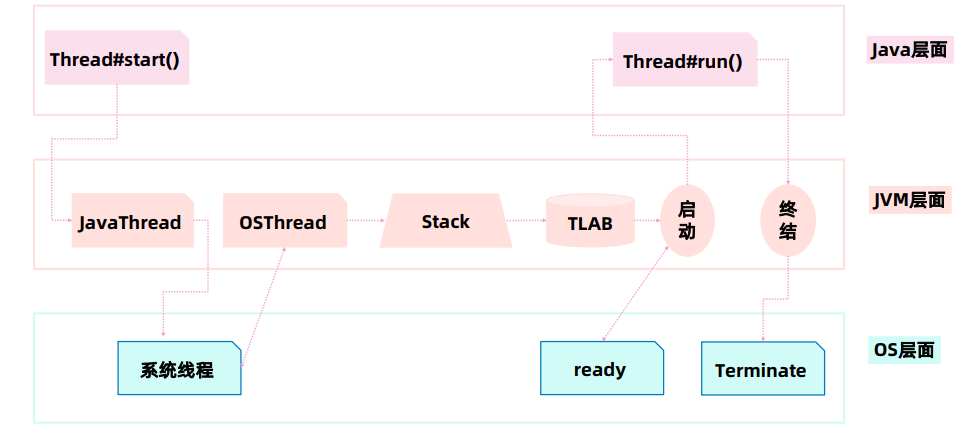
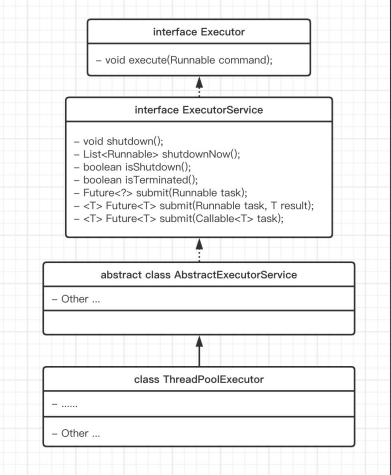
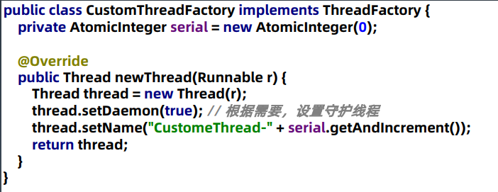

[TOC]

## 1、什么是线程、进程？

> **线程**（英语：thread）是[操作系统](https://zh.wikipedia.org/wiki/操作系统)能够进行运算[调度](https://zh.wikipedia.org/wiki/调度)的最小单位。大部分情况下，它被包含在[进程](https://zh.wikipedia.org/wiki/进程)之中，是[进程](https://zh.wikipedia.org/wiki/进程)中的实际运作单位。一条线程指的是[进程](https://zh.wikipedia.org/wiki/进程)中一个单一顺序的控制流，一个进程中可以并发多个线程，每条线程并行执行不同的任务。在[Unix System V](https://zh.wikipedia.org/wiki/Unix)及[SunOS](https://zh.wikipedia.org/wiki/SunOS)中也被称为轻量进程（lightweight processes），但轻量进程更多指内核线程（kernel thread），而把用户线程（user thread）称为线程。
>
> --wikipedia


>**进程**（英语：process），是指计算机中已运行的[程序](https://zh.wikipedia.org/wiki/程式)。进程曾经是[分时系统](https://zh.wikipedia.org/wiki/分時系統)的基本运作单位。在面向进程设计的系统（如早期的[UNIX](https://zh.wikipedia.org/wiki/UNIX)，[Linux](https://zh.wikipedia.org/wiki/Linux) 2.4及更早的版本）中，进程是程序的基本执行实体；在面向线程设计的系统（如当代多数操作系统、[Linux](https://zh.wikipedia.org/wiki/Linux) 2.6及更新的版本）中，进程本身不是基本运行单位，而是[线程](https://zh.wikipedia.org/wiki/執行緒)的容器。
>
>程序本身只是指令、数据及其组织形式的描述，相当于一个名词，进程才是程序（那些指令和数据）的真正运行实例，可以想像说是现在进行式。
>
>

## 2、为什么需要多线程？

* 应用程序为单进程，充分利用多核CPU，任务分工协作，让这个程序运行速度更快。
* CPU与内存、磁盘等IO设备之间性能差距过大，导致IO等待，利用多线程充分利用CPU资源。

* 单CPU下也可以让多个进程并发运行，在人类看起来是在同时运行

> 关于为什么需要多线程，参考《java并发编程实战》第一章

## 3、 Java中如何使用多线程？  

JAVA中的线程与操作系统线程的关系：

java Thread与os Thead的启动交互过程



>关于java线程与os线程的关系和实现原理，具体需要参考《深入JVM虚拟机》的12.4章节

### 如何简单创建和执行线程？

​	Thread、Runnable

### 守护线程

​	为什么需要？一些任务是依附主任务而活着，比如：一个主线程，负责数据库连接；会有几个守护线程负责监控、统计。所以主线程销毁后，守护线程就没有存在的必要了。

### Thread的常用方法

* wait：

  释放当前的锁，直到其他线程调用notify或notifyAll。必须使用monitor的object调用，且在monitor内调用。

* wait(timeout):释放当前的锁，直到其他线程调用notify或notifyAll，或者达到time时间。必须使用monitor的object调用，且在monitor内调用。

* notify：通知1个线程。

* notifyAll:通知所有等待线程

> wait/notify详解: https://www.jianshu.com/p/b8df805825b5

* interrupt

  ​	interrupt方法并不是用来中断线程，而是告知线程该中断了。具体是继续运行还是中断，需要由线程自己决定。

  ​	1.一个线程不应该被其他线程真正的中断

  ​    2.Thread.interrupt()的作用不是中断某个线程，而是通知一个线程应该中断了。

  ​    3.被通知中断的线程具体是中断还是选择继续运行由该线程自己决定。

  ​    4.具体来说，当对一个线程调用interrupt()方法时，

  ​      1）当线程处于sleep()、wait()、join()等状态时，该线程将立即退出阻塞状态，然后抛出一个   InterruptedException异常

  ​      2）当线程处于正常状态时，该线程的中断标志位将被置为true，仅此而已。线程将继续正常运行。

  ​    5.interrupt()方法并不会中断线程，需要线程本身配合才行。

  ​      也就是说，一个线程如果有中断的需求，可以这样做：

  ​      1）在运行时，经常检查自己的中断标志位，如果被设置了中断标志，就自动停止运行

  ​      2）在调用阻塞方法[sleep()、wait()、join()]时，正确处理InterruptedException异常（如catch异常后，主动退出）

  ​	6.Thread.isInterrupted()的作用是判断是否被中断。

  ​	7.Thread.interrupted()的作用是判断是否被中断，并清除标志位。目的是下次继续检测标志位。如果一个线程被设置中断标志后，选择结束线程那么自然不存在下次的问题，而如果一个线程被设置中断标识后，进行了一些处理后选择继续进行任务，而且这个任务也是需要被中断的，那么当然需要清除标志位。

  ​	标准用法：

  ```
  Thread thread = new Thread(() -> {
      while (!Thread.interrupted()) {
         sleep some times...
      }
       // do more work.
  });
  thread.start();
  
  // 满足some condition
  thread.interrupt();
  ```
* wait/notify/notifyAll

  wait方法所在的线程是消费者。notify方法所在的线程是生产者。构成了整个等待/通知模式。wait的线程进入等待队列，被notify之后回到阻塞队列，等待锁可获取时竞争获取锁。

* join

  join底层使用wait实现。

  #### 线程的中断和异常处理

  1、线程内部异常不溢出到父线程。

  2、interrupt调用打断异常机制

  3、如果是计算密集型的操作？

  		分段处理，每个片段检查一下状态，是不是要终止。  

## 4、多线程有哪些问题？

* 数据一致性问题。CPU高速缓存、非原子的读写操作导致的数据不一致问题（锁、并发原子类、并发集合类）

* 死锁。多线程共同处理同一任务时，需要进行通信保证正确的数据状态，所以需要线程锁机制，可能出现死锁。（对并发理解更深刻，多线程使用得当，代码层面避免死锁）
* 线程上下文切换的开销：线程有各自的栈、程序计数器等上下文信息，在发生线程切换时需要保存和恢复上下文。（量化、压测线程上下文切换的CPU时间开销，与IO等待时间对比，通过线程池同一管理和配置合理的线程数）
* 多线程编程导致代码复杂度上升。（线程池[javaExecutor]、线程工具类[CountDownLatch等]对业务逻辑和线程调度逻辑解耦。）

## 5、如何解决多线程下的数据安全问题？

#### 线程安全问题发生的原因

同一个进程内的多个线程共享资源，对资源的访问顺序敏感，存在竞态条件（Race Condition）。常见的竞态条件类型：检查-执行、读取-修改-写入，都是依据前一个数据的当前状态，执行下一个操作。

### 影响并发安全的几个性质

* 原子性

  个人理解：除了CPU原子性指令之外，synchronized等锁保证的原子性可以理解为一组操作的中间过程的数据不会被其他线程插入篡改。

* 可见性

  在CPU缓存存在的前提下，主存对线程执行的可见性。

* 有序性

  过程中指令的有序性。

### happen-before原则

1. 程序次序规则：一个线程内，按照代码先后顺序
2. 锁定规则：一个 unLock 操作先行发生于后面对同一个锁的 lock 操作
3. Volatile 变量规则：对一个变量的写操作先行发生于后面对这个变量的读操作
4. 传递规则：如果操作 A 先行发生于操作 B，而操作 B 又先行发生于操作 C，则可以得出 A 先于 C
5. 线程启动规则：Thread 对象的 start() 方法先行发生于此线程的每一个动作
6. 线程中断规则：对线程 interrupt() 方法的调用先行发生于被中断线程的代码检测到中断事件的发生
7. 线程终结规则：线程中所有的操作都先行发生于线程的终止检测，我们可以通过 Thread.join() 方法结束、
   Thread.isAlive() 的返回值手段检测到线程已经终止执行
8. 对象终结规则：一个对象的初始化完成先行发生于他的 finalize() 方法的开始  

### final 

对于成员变量内存可见性的影响：构造函数结束返回后，final域最新的值保证对其他线程可见。

### volatile

作用：强制线程总是从共享内存中获取变量值

字节码层面：ACC_VOLATILE 成员变量修饰符

### synchronized

作用：保证synchronized修饰的代码块同一时刻只有一个线程在执行

字节码层面：monitorenter、monitorexit、ACC_SYNCHRONIZED（方法修饰符）

特性：互斥锁（只能一个线程持有）、可重入、抛出异常会释放锁、有偏向锁等底层优化

缺点：无法多个线程同时持有、不够灵活...

### 原子类


## 6、如何解决死锁问题？（活跃性问题）


## 7、 如何解决线程上下文开销问题，并发性能差问题？（性能问题）

### 线程池大小配置合理

#### 为什么需要线程池？

多线程带来的问题：1、线程过多时上下文切换开销可能很大，需要控制线程数。线程之间需要协作、统一管理，所以通过线程池控制数量和管理运行策略。2、线程创建和销毁较为耗资源，所以用线程池减少这一过程的开销。3、将线程中的业务逻辑与线程调度逻辑分离，职责分明，让程序员专注业务处理。


#### java线程池



* Executor  执行者-顶层接口

  提供执行任务无返回值的接口。

* ExcutorService: 接口 API

  提供线程池的关闭、有返回值的任务处理接口

* ThreadFactory  ：线程工厂

* Executors: 线程池工具类


#### 线程池核心类 ThreadPoolExecutor

* 核心参数

* 核心线程数

* 最大线程数

* 缓冲队列

  * ArrayBlockingQueue   规定大小的队列。数组实现
  * LinkedBlockingQueue   规定大小的队列。链表实现。
  * PriorityBlockingQueue 无界队列。数组实现。不是FIFO，有优先级
  * SynchronousQueue  同步队列。入队和出队有同步锁

* 拒绝策略

  * AbortPolicy   丢弃任务并抛出 RejectedExecutionException
    异常  
  * DiscardPolicy：丢弃任务，但是不抛出异常。  
  * DiscardOldestPolicy：丢弃队列最前面的任务，然后重新提
    交被拒绝的任务  
  * CallerRunsPolicy：由调用线程（提交任务的线程）处理该任
    务  

* 线程回收时间

* ThreadFactory 

  * 重写newThread方法，给线程设置统一的名字和其他属性。

  


>com.google.common.util.concurrent.ThreadFactoryBuilder 建造者可以用于构造ThreadFactory

核心线程数、最大线程数和队列、策略的关系图：


#### tomcat等线程池优化设置，示例：

public class ExecutorServiceTest02 {
    public static void main(String[] args) {
        ThreadFactoryBuilder builder = new ThreadFactoryBuilder();
        builder.setNameFormat("rpc-pool-%d");
        ThreadPoolExecutor executor = new ThreadPoolExecutor(100, 100, 0, TimeUnit.SECONDS, new LinkedBlockingQueue(1000), builder.build());
        executor.prestartAllCoreThreads();
    }
}
jps -l
jstack 36848
可以看到线程日志如下，rpc-pool-xx一共有一百个线程，线程池中未运行的线程状态为WAITING (parking)。
所以在优化tomcat等线程池时，需要根据线程名称，判断高峰期处于运行和等待状态的线程数量，酌情增加或减少线程池大小。

"rpc-pool-99" #111 prio=5 os_prio=0 tid=0x000000001fecd000 nid=0x56fc waiting on condition [0x0000000026cee000]
   java.lang.Thread.State: WAITING (parking)
        at sun.misc.Unsafe.park(Native Method)
        - parking to wait for  <0x000000076bc503f0> (a java.util.concurrent.locks.AbstractQueuedSynchronizer$ConditionObject)
                at java.util.concurrent.locks.LockSupport.park(LockSupport.java:175)
                at java.util.concurrent.locks.AbstractQueuedSynchronizer$ConditionObject.await(AbstractQueuedSynchronizer.java:2039)
                at java.util.concurrent.LinkedBlockingQueue.take(LinkedBlockingQueue.java:442)
                at java.util.concurrent.ThreadPoolExecutor.getTask(ThreadPoolExecutor.java:1074)
                at java.util.concurrent.ThreadPoolExecutor.runWorker(ThreadPoolExecutor.java:1134)
                at java.util.concurrent.ThreadPoolExecutor$Worker.run(ThreadPoolExecutor.java:624)
                at java.lang.Thread.run(Thread.java:748)

### 锁的位置和粒度合理


## 8、多线程编程导致代码复杂度上升

### 线程池统一调度线程，对业务实现屏蔽线程相关细节