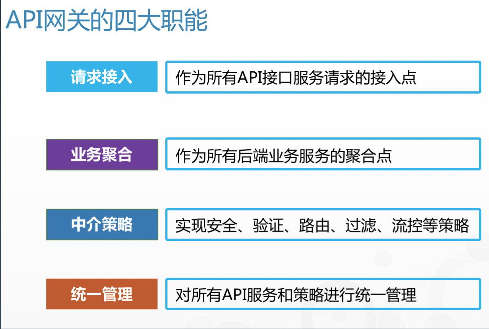
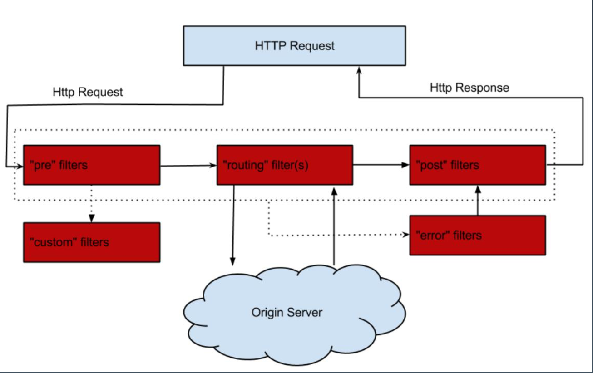
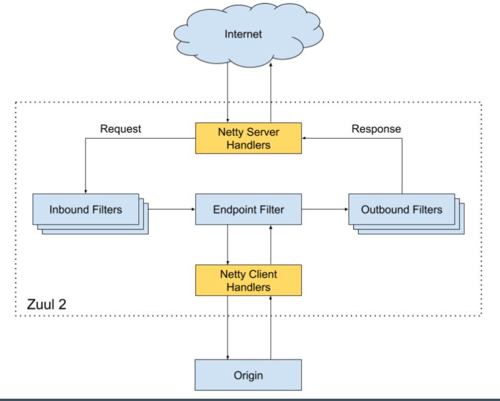
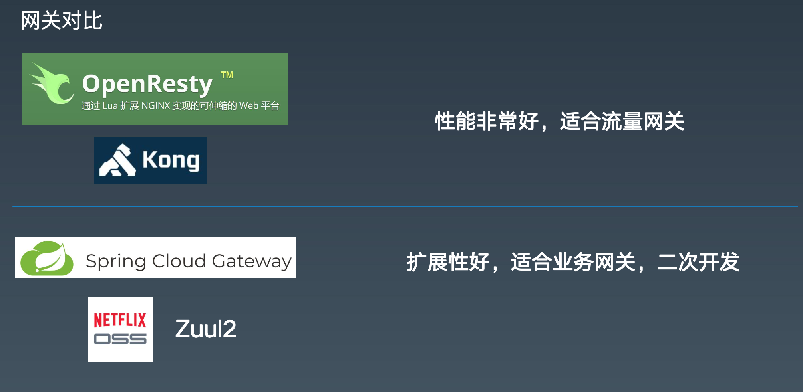

[TOC]

## 再谈谈什么是高性能  

### 高性能意味着什么？

主要代表三个部分：

* 高并发用户(Concurrent Users) 

    用户量比较大。比如系统月活1亿。

* 高吞吐量(Throughput) 

    每秒的高并发。对应QPS或TPS

* 低延迟(Latency)

    P50/P90/P99：50、90、99%的请求的平均处理时间。此处的延迟考虑的只是应用服务器的处理时间，请求响应时间（RRT）是从客户端的角度来考虑的，包括了延迟和网络请求响应的传输时间。

### 高性能带来的挑战

1、系统复杂度*10 以上

2、建设与维护成本++

3、故障或bug导致的破坏性++

### 针对这些挑战的应对策略

稳定性建设（混沌工程）：

1、容量

2、爆炸半径

3、工程方面积累与改进

## Netty 如何实现高性能

netty基于异步、事件驱动、封装了NIO，比起BIO性能大幅提升。

BIO线程阻塞等待连接、用户缓存与内核缓存的数据拷贝，NIO有内核中的selector实现数据准备轮询。

Netty提供了基于reactor模型的实现。有单线程、多线程和主从（boss、workerEventLoopGroup）三种reactor模型。

##  Netty 网络程序优化

### 粘包和拆包

粘包：两个数据包一起被读出来，导致无法转换为我们想要的数据。

拆包：一个数据包被分为两部分读了。

#### netty如何解决粘包和拆包

netty中提供了编解码器，定义解码的规则。比如jsoin、定长等编解码器。

### Nagle 与 TCP_NODELAY

#### Nagle

解决问题：网络传输中可能很多时候只需要传几个字节的小数据包，这时数据包空间和性能就被浪费了。所以可以使用Nagle算法优化。

网络拥堵与 Nagle 算法优化，具体优化条件: 

	- 缓冲区满，调大数据缓冲区，可以让每个数据包大一些。
 - 达到超时，设置超时时间，超过这个时间不管满没满都发送。

TCP物理层面的参数优化：

MTU: Maxitum Transmission Unit 最大传输单元
MSS: Maxitum Segment Size 最大分段大小, 为 MTU - 20(IP) - 20(TCP)。

默认值：MTU = 1500 Byte MSS = 1460 Byte	

所以我们需要考虑让我们的数据包尽量小于这两个值，在一个包内接收完毕。

### TCP连接和断开机制

#### 三次握手

#### 四次挥手

### Netty 优化

1、不要阻塞 EventLoop

​	EventLoop负责处理所有的连接channel，所以阻塞在某一个连接上会影响其他连接。所以要使用额外的线程池处理长业务逻辑。

2、系统参数优化（系统TCP层面配置）
	ulimit -a  文件描述符

​	/proc/sys/net/ipv4/tcp_fin_timeout,  linux 的TCP发送断开连接方最后的等待超时时间

​	TcpTimedWaitDelay  windows注册表中的 TCP发送断开连接方最后的等待超时时间
3、缓冲区优化 （系统TCP层面配置）

​	SO_RCVBUF 缓冲区接收

 	SO_SNDBUF 缓冲区发送 

​	SO_BACKLOG  TCP正在建立和已经连接的总数和

​	REUSEXXX 重用
4、心跳周期优化 心跳机制与短线重连
5、内存与 ByteBuffer 优化 DirectBuffer与HeapBuffer
6、其他优化

- ioRatio
- Watermark
- TrafficShaping

## 典型应用：API 网关

### 网关的功能

### 网关的分类

#### 流量网关

关注稳定与安全
 全局性流控
 日志统计
 防止 SQL 注入 

 防止 Web 攻击 

 屏蔽工具扫描 

 黑白 IP 名单 

 证书/加解密处理

典型项目：nginx、kong

#### 业务网关

提供更好的服务
 服务级别流控
 服务降级与熔断
 路由与负载均衡、灰度策略 

 服务过滤、聚合与发现 

 权限验证与用户等级策略

 业务规则与参数校验
 多级缓存策略

典型项目：zuul、zuul2、springcloud gateway、soul

### zuul

基于BIO。

### zuul2

基于netty。

### spring cloud gateway

### 网关对比

流量网关的性能比业务网关速度快5-10倍。但是nginx用C++，openResty使用lua，开发困难。

## 自己动手实现 API 网关

## 总结

### Nagle 与 TCP_NODELAY

* 

平衡数据包和延迟

TCP_NODELAY