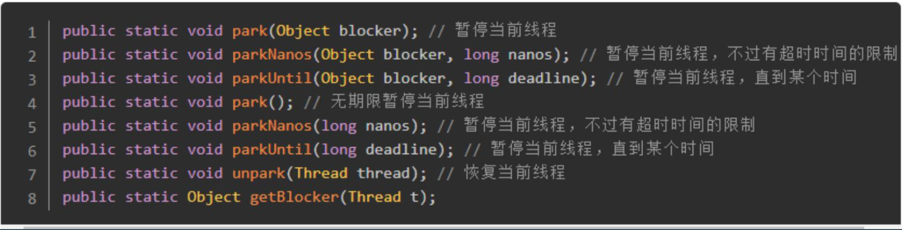
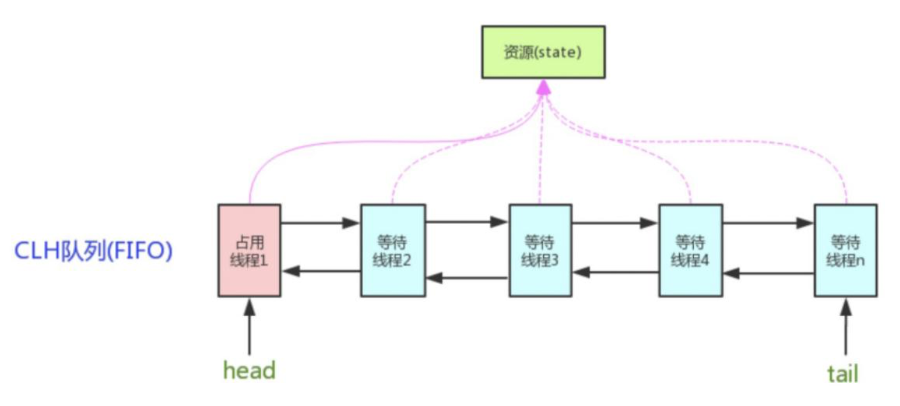
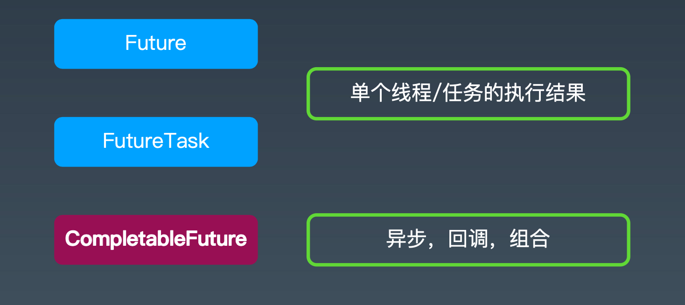
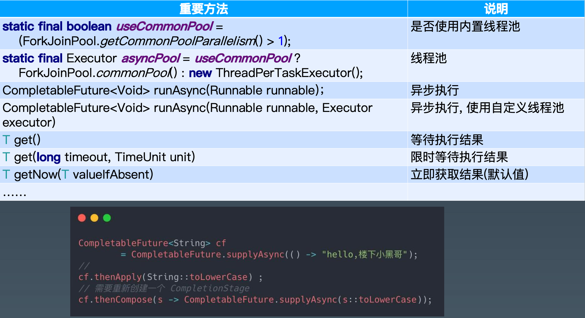

# 并发编程2

## java并发包

需要控制同一时间只有一个线程在读写资源，有了锁

我们需要多线程操作数据，所以有了原子类。

我们需要统一管理线程资源，所以有了线程池

我们需要统一操作多个线程，所以有了工具类

需要安全操作集合，所以有了集合类

### 并发中的类按功能分为：

锁机制类 Locks : Lock, Condition, ReentrantLock, ReadWriteLock,LockSupport 

原子操作类 Atomic : AtomicInteger, AtomicLong, LongAdder

线程池相关类 Executer : Future, Callable, Executor, ExecutorService 

信号量三组工具类 Tools : CountDownLatch, CyclicBarrier, Semaphore 

并发集合类 Collections : CopyOnWriteArrayList, ConcurrentMap

## 锁

### Lock

reentrantlock是可重入锁，可设置是否是公平锁。提供内存可见性支持。

### ReadWriteLock

可重入、可设置是否公平

### Condition

类似于 wait notify，必须在lock中使用。区别是一个lock可以有多个condition

### LockSupport



### 用锁的最佳实践

1、降低锁范围:锁定代码的范围/作用域 

2、细分锁粒度:将一个大锁，拆分成多个小锁

## 并发原子类

原子类实现原理：1、CAS。CPU支持原子指令：compare and swap 指令，实现乐观锁，自旋不断重试。 2、value使用volatile保证内存可见性。

### 锁与无锁哪个好？

写冲突高的时候有锁好：减少CAS自旋浪费的cpu，适合使用悲观锁。

读多写少的时候：无锁好，加锁的代价较高(约束了缓存和编译优化)。适合乐观锁。

### LongAdder 对 AtomicLong 的改进

通过分段思想改进原子类， 大家想想，还有哪些是用这个思想?
多路归并的思想:

- 快排
- G1 GC
- ConcurrentHashMap

LongAdder的改进思路: 

​	1、AtomicInteger和AtomicLong里的value是所有 线程竞争读写的热点数据; 

​	2、将单个value拆分成跟线程一样多的数组Cell[]; 

​	3、每个线程写自己的Cell[i]++，最后对数组求和。

## 并发工具类

### AQS

AbstractQueuedSynchronizer，即队列同步器。它是构建锁或者其他同步组件的基础 (如Semaphore、CountDownLatch、ReentrantLock、ReentrantReadWriteLock)， 是JUC并发包中的核心基础组件，抽象了竞争的资源和线程队列。



• AbstractQueuedSynchronizer:抽象队列式的同步器

• 两种资源共享方式: 独占 | 共享，子类负责实现公平 OR 非公平

### Semaphore - 信号量

1. 准入数量 N，N =1 则等价于独占锁 
2. 相当于synchronized的进化版

使用场景:同一时间控制并发线程数

```
public class SemaphoreCounter {
    private int sum = 0;
    private Semaphore readSemaphore = new Semaphore(100, true);
    private Semaphore writeSemaphore = new Semaphore(1);

    public int incrAndGet() {
        try {
            writeSemaphore.acquireUninterruptibly();
            return ++sum;
        } finally {
            writeSemaphore.release();
        }
    }

    public int getSum() {
        try {
            readSemaphore.acquireUninterruptibly();
            return sum;
        } finally {
            readSemaphore.release();
        }
    }
}
```

### CountDownLatch

阻塞主线程，N个子线程满足条件时主线程继续。 

场景: Master 线程等待 Worker 线程把任务执行完 

示例: 等所有人干完手上的活，一起去吃饭。

### CyclicBarrier


### CompletableFuture





