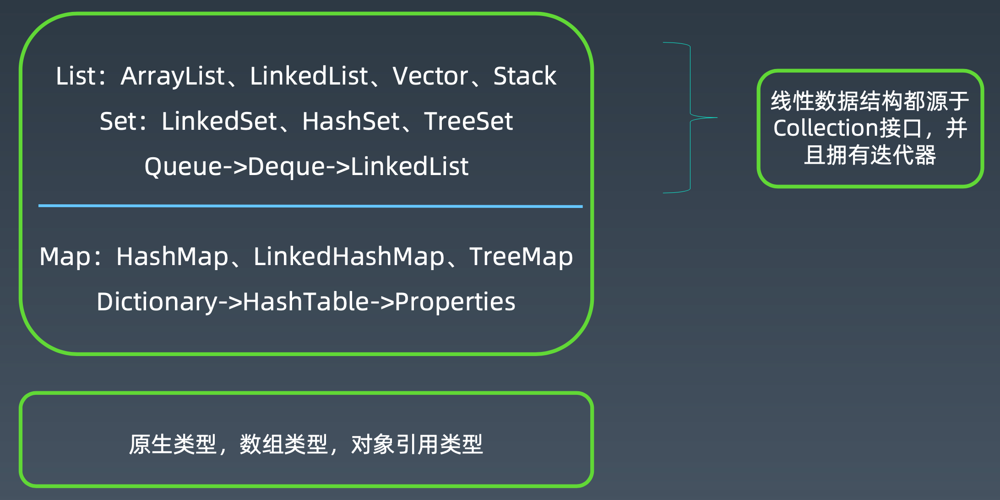
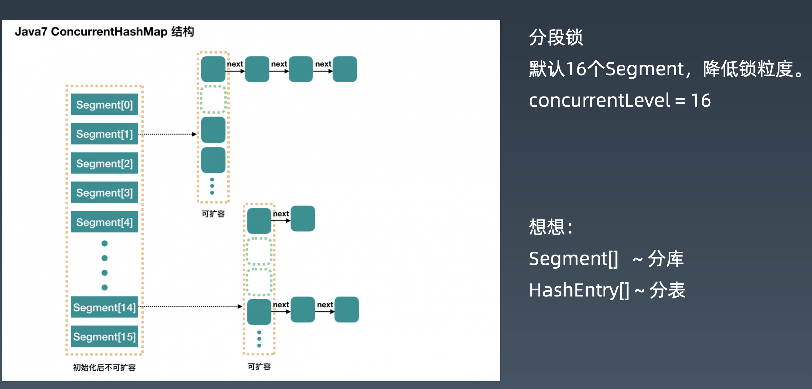
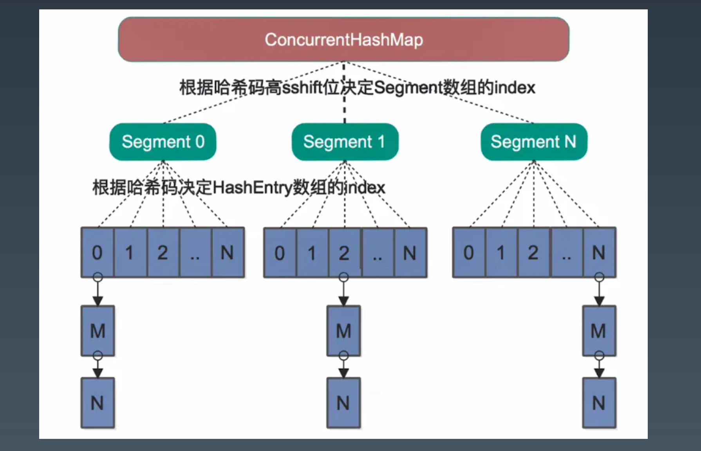
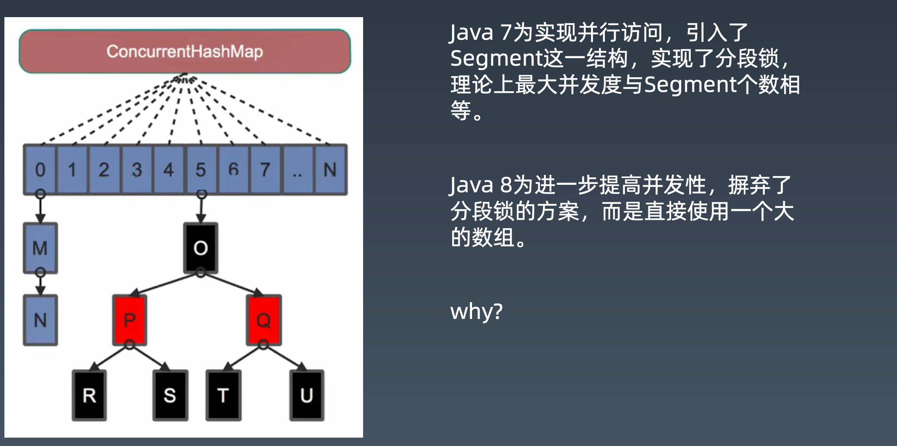

# 第八课

## 常用线程安全类型 

### 常见数据结构

为什么arraylist是线程不安全？多线程操作有什么问题？

如何解决arraylist线程不安全的问题？

1、读写没有并发要求的场景：vector/collections.syn..(collection)/Arrays.asList/Collections.unmodifiedCollection(c)

2、读多写少的场景：CopyOnWriteArrayList

### List线程安全的简单办法

- 1.ArrayList的方法都加上synchronized -> Vector
- 2.Collections.synchronizedList，强制将List的操作加上同步 
- 3.Arrays.asList，不允许添加删除，但是可以set替换元素
- 4.Collections.unmodifiableList，不允许修改内容，包括添加删除和set

### CopyOnWriteArrayList

核心改进原理: 

1、写加锁，保证不会写混乱
2、写在一个Copy副本上，而不是原始数据上 (GC young区用复制，old区用本区内的移动)
 读写分离 最终一致

### HashMap
基本特点:空间换时间，哈希冲突不大的情况下查找数据性能很高 

用途:存放指定key的对象，缓存对象 

原理:使用hash原理，存k-v数据，初始容量16，扩容x2，负载因子0.75 JDK8以后，在链表长度到8 & 数组长度到64时，使用红黑树。

安全问题:

1、写冲突， 2、读写问题，可能会死循环 3、keys()无序问题

### LinkedHashMap
基本特点:继承自HashMap，对Entry集合添加了一个双向链表 

用途:保证有序，特别是Java8 stream操作的toMap时使用 

原理:同LinkedList，包括插入顺序和访问顺序

安全问题: 同HashMap

### ConcurrentHashMap-Java7分段锁

### ConcurrentHashMap-Java8

## 并发线程相关内容

## 并发编程经验总结 

## 并发编程常见面试题

