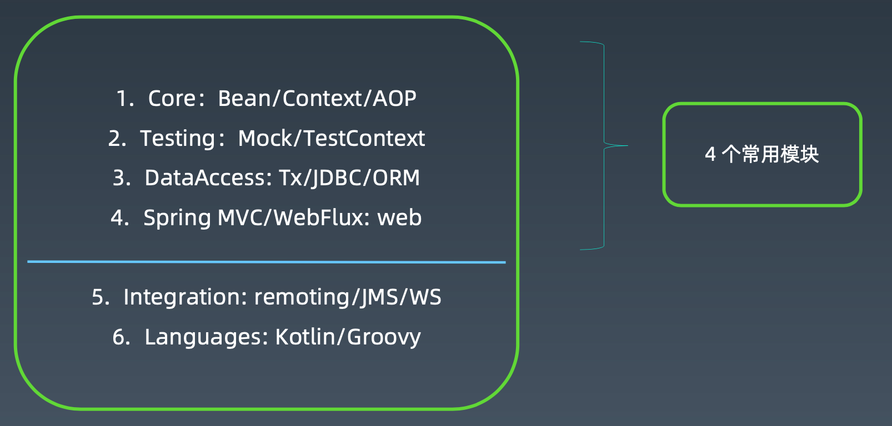
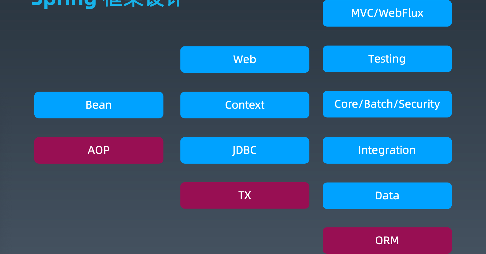

[TOC]

# java相关框架01

## 1.Spring 技术发展 

EJB提供了整个J2EE的运行时框架，框架很重，不灵活。

spring目标：让java开发更加容易。不需要依赖一些重量级的容器和框架。

通过spring可以将项目横向切分业务功能，纵向拆分功能层级(view/controlller/service/dao)，模块之间可以通过IO和AOP松耦合，职责分明。

spring越来越复杂，所以出现了springboot作为脚手架，简化spring框架搭建。

## 2.Spring 框架设计*

### spring框架是什么？

管理对象的生命周期、依赖关系处理（IOC）、通用功能统一松耦合处理(AOP)

### Spring framework 6大模块

引入 Spring 意味着引入了一种研发协作模式

## 3.Spring AOP 详解* 

 

## 4.Spring Bean 核心原理* 

## 5.Spring XML 配置原理* 

## 6.Spring Messaging 等技术