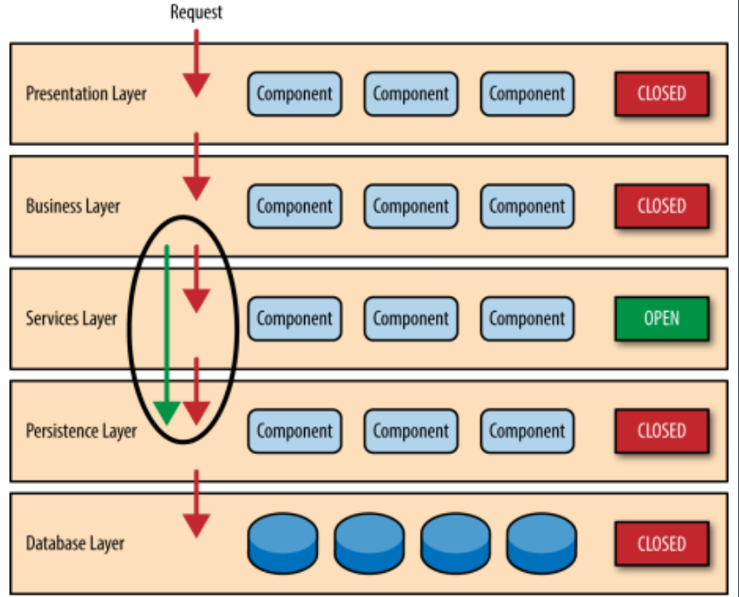
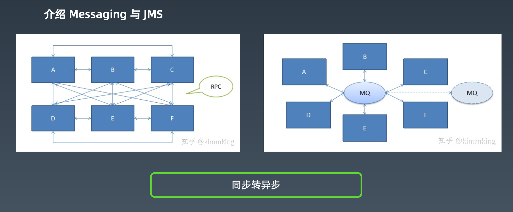

[TOC]

# java相关框架01

## 1.Spring 技术发展 

EJB提供了整个J2EE的运行时框架，框架很重，不灵活。

spring目标：让java开发更加容易。不需要依赖一些重量级的容器和框架。

通过spring可以将项目横向切分业务功能，纵向拆分功能层级(view/controlller/service/dao)，模块之间可以通过IOC和AOP松耦合，职责分明。

spring越来越复杂，所以出现了springboot作为脚手架，简化spring框架搭建。

## 2.Spring 框架设计*

### spring框架是什么？

管理对象的生命周期、依赖关系处理（IOC）、通用功能统一松耦合处理(AOP)

### Spring framework 6大模块

引入 Spring 意味着引入了一种研发协作模式

## 3.Spring AOP 详解* 

### Spring AOP

AOP-面向切面编程
Spring 早期版本的核心功能，管理对象生命周期与对象装配。
为了实现管理和装配，一个自然而然的想法就是，加一个中间层代理(字节码增强)来实现所有对象 的托管。

IoC-控制反转
也称为 DI(Dependency Injection)依赖注入。
对象装配思路的改进。
从对象 A 直接引用和操作对象 B，变成对象 A 里指需要依赖一个接口 IB，系统启动和装配阶段，把 IB 接口的实例对象注入到对象 A，这样 A 就不需要依赖一个 IB 接口的具体实现，也就是类 B。 
从而可以实现在不修改代码的情况，修改配置文件，即可以运行时替换成注入 IB 接口另一实现类 C 的一个对象实例。 

### aop的使用

1、配置文件

2、注解配置

### AOP底层的字节码技术：类的动态生成和修改

图中：Instrumentation对应的java agent的技术，比如jvm-sandbox。

## 4.Spring Bean 核心原理* 

### Spring Bean 生命周期

为什么加载过程这么复杂？

为了bean初始化期间的各种时期用户都可以自定义一些操作，满足各种功能需要。

### debug spring源码小技巧

显式声明构造函数和setter方法，然后debug。

## 5.Spring XML 配置原理* 

通过spring.schemas文件找到XML文件的定义，检查XML是否正确。

通过spring.handler文件，找到对应的handler，解析xml生成bean。

### 如何自定义spring配置文件的XSD规范？

### Spring Bean 配置方式演化

## 6.Spring Messaging 等技术

