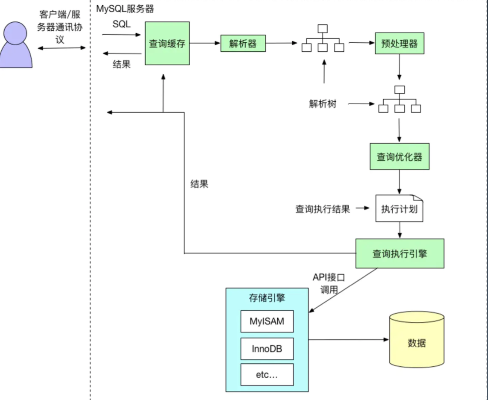
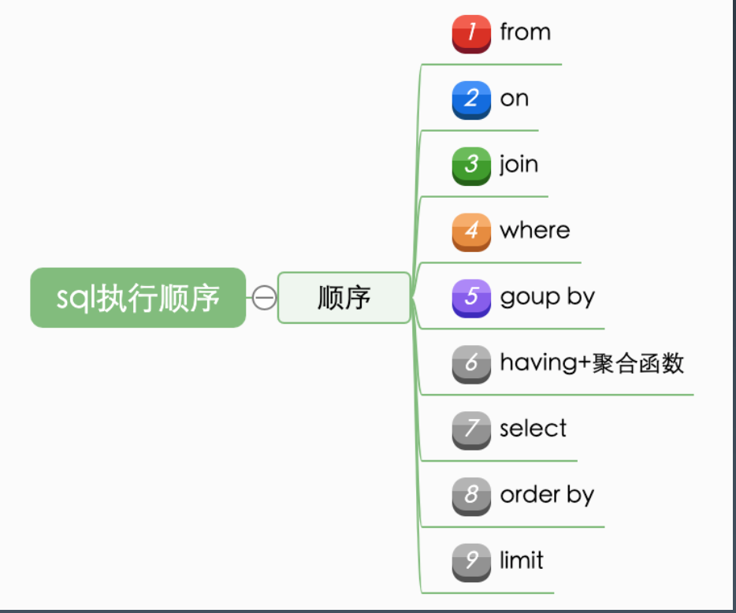

# 再聊聊性能优化

## 复习一下什么是性能

- 吞吐与延迟 : 有些结论是反直觉的，指导我们关注什么
    - 两个链路长度不同的客户端，请求同一个服务，水管直径相同，吞吐量相同，但是延迟不同。
- 没有量化就没有改进:监控与度量指标，指导我们怎么去入手。我们需要通过监测数据才能量化系统的性能。
-  80/20原则:先优化性能瓶颈问题，指导我们如何去优化。
- 过早的优化是万恶之源:指导我们要选择优化的时机
- 脱离场景谈性能都是耍流氓:指导我们对性能要求要符合实际
    - 服务器配置、业务场景是否操作DB等

## DB/SQL 优化是业务系统性能优化的核心

业务系统的分类:计算密集型、数据密集型
业务处理本身无状态，数据状态最终要保存到数据库 

一般来说，DB/SQL 操作的消耗在一次处理中占比最大 

业务系统发展的不同阶段和时期，性能瓶颈要点不同，类似木桶装水

# 关系数据库 MySQL

## 什么是关系数据库

1970年 codd提出关系模型，以关系代数理论为数学技术。

之后基于这个模型，出现了关系型数据库。

### 如何设计数据表？

E-R图

### 数据库设计范式

1NF:消除重复数据，即每一列都是不可再分的基本数据项; 每个列都是原子的。

2NF:消除部分依赖，表中没有列只与主键的部分相关，即每一行都被主键唯一标识; 每个列都有主键。

3NF:消除传递依赖，消除表中列不依赖主键，而是依赖表中的非主键列的情况，即没 有列是与主键不相关的。
从表只引用主表的主键， 即表中每列都和主键相关。

BCNF:Boyce-Codd Normal Form(巴斯-科德范式) 3NF 的基础上消除主属性对于码的部分与传递函数依赖。

## 常见关系数据库 

开源:MySQL、PostgreSQL
商业:Oracle，DB2，SQL Server
内存数据库:Redis?，VoltDB
图数据库:Neo4j，Nebula
时序数据库:InfluxDB、openTSDB 其他关系数据库:Access、Sqlite、H2、Derby、Sybase、Infomix 等
NoSQL 数据库:MongoDB、Hbase、Cassandra、CouchDB
NewSQL/ 分布式数据库:TiDB、CockroachDB、NuoDB、OpenGauss、OB、TDSQL

## SQL

结构化查询语言包含 6 个部分:
1、数据查询语言(DQL: Data Query Language):其语句，也称为“数据检索语句”，用以从表 中获得数据，确定数据怎样在应用程序给出。保留字 SELECT 是 DQL(也是所有 SQL)用得最多 的动词，其他 DQL 常用的保留字有 WHERE，ORDER BY，GROUP BY 和 HAVING。这些 DQL 保 留字常与其它类型的 SQL 语句一起使用。
2、数据操作语言(DML:Data Manipulation Language):其语句包括动词 INSERT、 UPDATE 和 DELETE。它们分别用于添加、修改和删除。
3、事务控制语言(TCL):它的语句能确保被 DML 语句影响的表的所有行及时得以更新。包括 COMMIT(提交)命令、SAVEPOINT(保存点)命令、ROLLBACK(回滚)命令。
4、数据控制语言(DCL):它的语句通过 GRANT 或 REVOKE 实现权限控制，确定单个用户和用 户组对数据库对象的访问。某些 RDBMS 可用 GRANT 或 REVOKE 控制对表单个列的访问。
5、数据定义语言(DDL):其语句包括动词 CREATE,ALTER 和 DROP。在数据库中创建新表或修 改、删除表(CREAT TABLE 或 DROP TABLE);为表加入索引等。
6、指针控制语言(CCL):它的语句，像 DECLARE CURSOR，FETCH INTO 和 UPDATE WHERE CURRENT 用于对一个或多个表单独行的操作。

## MySQL 数据库

### 5.6/5.7的差异

5.7支持:

- 多主
- MGR 高可用 - 分区表
- json
- 性能
- 修复 XA 等

5.7/8.0的差异

- 通用表达式
- 窗口函数
- 持久化参数
- 自增列持久化
- 默认编码 utf8mb4 - DDL 原子性
- JSON 增强
- 不再对 group by 进行隐式排序??==> 坑

# 深入数据库原理

### mysql架构

客户端、服务层(连接器、解析器、优化器、执行引擎）、存储引擎（innoDB）

## mysql存储

表存储路径 /usr/local/mysql/data/security00

内容：

-rw-r-----  1 _mysql  _mysql   8.4K Jun 20  2019 date_test.frm
-rw-r-----  1 _mysql  _mysql    96K Jul  1  2019 date_test.ibd
-rw-r-----  1 _mysql  _mysql   8.4K Jun 20  2019 date_test2.frm
-rw-r-----  1 _mysql  _mysql    96K Jul 24  2019 date_test2.ibd
-rw-r-----  1 _mysql  _mysql    67B Jun 11  2019 db.opt
-rw-r-----  1 _mysql  _mysql     9B Jun 11  2019 hibernate_sequence.MYD
-rw-r-----  1 _mysql  _mysql   1.0K Jun 11  2019 hibernate_sequence.MYI
-rw-r-----  1 _mysql  _mysql   8.4K Jun 11  2019 hibernate_sequence.frm
-rw-r-----  1 _mysql  _mysql   8.4K Jan  5 22:11 t.frm
-rw-r-----  1 _mysql  _mysql    13M Jan  5 22:13 t.ibd
-rw-r-----  1 _mysql  _mysql   8.5K Jun 11  2019 user.frm
-rw-r-----  1 _mysql  _mysql    96K Oct 27  2019 user.ibd
-rw-r-----  1 _mysql  _mysql   8.4K Jun 11  2020 user_info.frm
-rw-r-----  1 _mysql  _mysql    96K Jun 11  2020 user_info.ibd

数据库两种存储模式

独占模式
1)、日志组文件:ib_logfile0和ib_logfile1，默认均为5M 

2)、表结构文件:*.frm
3)、独占表空间文件:*.ibd
4)、字符集和排序规则文件:db.opt
5)、binlog 二进制日志文件:记录主数据库服务器的 DDL 和 DML 操作 

6)、二进制日志索引文件:master-bin.index
共享模式 innodb_file_per_table=1
1)、数据都在 ibdata1

## mysql简化执行流程

## mysql详细执行流程

## 存储引擎对比和mysql服务器线程状态

## SQL 执行顺序

1-3 确立表关系、4-7 筛选数据   8-9 顺序和行数 

## mysql索引原理

数据是按页来分块的，当一个数据被用 到时，其附近的数据也通常会马上被使 用。
InnoDB 使用 B+ 树实现聚集索引。聚集索引的意思是：主键索引上的叶子节点上直接存储了数据行。

* 为什么一般单表数据不超过2000万?

# mysql配置优化

### 1)连接请求的变量 

1、max_connections  mysql的最大连接数

2、back_log  TCP backlog

3、wait_timeout和interative_timeout  连接超时断开的时间

### 查看参数配置

- 快速查询：show (global) variables like xxx 
- 修改：my.cnf 文件

### 2)缓冲区变量

4、key_buffer_size    MYISAM引擎的索引缓存大小

5、query_cache_size(查询缓存简称 QC)   查询缓存，一般不开启，所以不用设置。

6、max_connect_errors: 

7、sort_buffer_size:  排序的内存缓冲区大小，如果排序时临时表大小超过这个值，就需要使用磁盘存储辅助归并排序。(explain 里可以看到extra字段有use filesort)

8、max_allowed_packet=32M 服务端接收的数据包大小限制，如果一次update发送的数据超过这个值，会执行失败。但是太大容易丢包。

9、join_buffer_size=2M  表join连接查询的缓冲。

10、thread_cache_size=300  ：缓存的线程数。

​	show  global status like 'Thread%';

​	**Threads_created：**创建过的线程数，如果发现Threads_created值过大的话，表明MySQL服务器一直在创建线程，这也是比较耗资源，可以适当增加配置文件中thread_cache_size值

### 3)配置 Innodb 的几个变量 

11、innodb_buffer_pool_size  缓冲区大小。 InnoDB 用来高速缓冲数据和索引内存缓冲大小。 更大的设置可以使访问数据时减少磁盘 I/O。在一个专用的数据库服务器上可以将它设置为物理内存的 80 %。 不要将它设置太大，因为物理内存的使用竞争可能会影响操作系统的页面调用。

12、innodb_flush_log_at_trx_commit   log刷盘策略。  通常设置为 1，意味着在事务提交前日志已被写入磁盘， 事务可以运行更长以及服务崩溃后的修复能力。如果你愿意减弱这个安全，或你运行的是比较小的事务处理，可以将它设置为 0 ，以减少写日志文件的磁盘 I/O。这个选项默认设置为 0。

13、innodb_thread_concurrency=0 	InnoDB 会试图将 InnoDB 服务的使用的操作系统进程小于或等于这里所设定的数值。

14、innodb_log_buffer_size  InnoDB 将日志写入日志磁盘文件前的缓冲大小。理想值为 1M 至 8M。

15、innodb_log_file_size=50M  日志组中的每个日志文件的大小(单位 MB)。

16、innodb_log_files_in_group=3  日志组中的日志文件数目。InnoDB 以环型方式(circular fashion)写入文件。数值 3 被推荐使用。在 my.cnf 中以数字格式设置

17、read_buffer_size=1M  MySQL读入缓冲区大小。对表进行顺序扫描的请求将分配一个读入缓冲区，MySQL会为它分配一段内存缓冲区。read_buffer_size变量控制这一缓冲区的大小。如果对表的顺序扫描请求非常频繁，并且你认为频繁扫描进行得太慢，可以通过增加该变量值以及内存缓冲区大小提高其性能。

18、read_rnd_buffer_size=16M 

19、bulk_insert_buffer_size=64M 

20、binary log

# 数据库设计优化

- 如何恰当选择引擎?

    一般都使用innodb。不需要事务就可以用其他的。

- 库表如何命名?

    按业务名统一

- 如何合理拆分宽表?

    合理利用范式。根据业务含义拆分，但考虑查询性能适当冗余。

- 如何选择恰当数据类型:明确、尽量小

- char、varchar 的选择

- (text/blob/clob)的使用问题?  一般不要用。

- 文件、图片是否要存入到数据库? 一般不要

-  时间日期的存储问题?

- 数值的精度问题?

- 是否使用外键、触发器?

- 唯一约束和索引的关系?
- 是否可以冗余字段?
- 是否使用游标、变量、视图、自定义函数、存储过程? - 自增主键的使用问题?
- 能够在线修改表结构(DDL 操作)? 一般停止业务，业务低谷期做
- 逻辑删除还是物理删除?
- 要不要加 create_time,update_time 时间戳?
- 数据库碎片问题? 重建表，压缩数据。一般停止业务，业务低谷期做
- 如何快速导入导出、备份数据? Jdbc或 mysql dump。