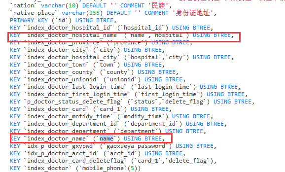

## homework

## 13

### 1、（选做）用今天课上学习的知识，分析自己系统的 SQL 和表结构

#### 索引问题

01、索引最左前缀原则：发现业务表中单索引和联合索引存在重复现象，name单索引是不需要的。如下图

02、sql中使用联合索引避免回表

03、sql中使用联合索引避免use filesort，或考虑排序内存占用的buffer_size，关注explain避免磁盘辅助归并排序

04、建立索引时考虑索引区分度问题

05、执行sql前看执行计划，确认mysql优化器真的依据抽样正确选择了预期的索引。

06、执行批量导入时，可以先将索引删除。导入结束后再统一重建索引。

07、join查询要走索引，其次驱动左表要是小表。关注explain 避免左表分块block loop join。

08、长字符串创建索引的方法：为了节省空间，可以根据left或right确定索引区分度，创建前缀索引。如果后几位区分度高，则可以倒序字段然后使用倒序的前缀索引。或者取hash作为索引。

#### 锁

01、上线执行DDL时，考虑到MDL锁问题，一般在业务低谷期来做。

02、update语句条件要走索引，而且不能一次锁定太多行。

03、在事务内最后锁定并发竞争最大的行，减少锁的持有时间。在并发较高时，死锁检测会占用大量CPU，解决方案：将单行数据拆分为多行segment，减少行锁竞争。

04、在存在竞态条件的一个事务多sql时，尽量使用乐观锁代替悲观锁。

#### 事务

01、单个事务不要太长，导致大量undolog无法被回收，占用空间过大；

02、spring中，在当前方法没有开启事务的情况下，不要使用this等方式调用方法，会导致调用的不是AOP代理对象，导致事务不生效。

### 2、（必做）按自己设计的表结构，插入100万订单模拟数据，测试不同方式的插入效率。

### 3、（选做）按自己设计的表结构，插入1000万订单模拟数据，测试不同方式的插入效率。

### 4、（选做）使用不同的索引或组合，测试不同方式查询效率。

### 5、（选做）调整测试数据，使得数据尽量均匀，模拟1年时间内的交易，计算一年的销售报表：销售总额，订单数，客单价，每月销售量，前十的商品等等（可以自己设计更多指标）。

### 6、（选做）尝试自己做一个 ID 生成器（可以模拟 Seq 或 Snowflake）。

### 7、（选做）尝试实现或改造一个非精确分页的程序。  

## 14 

### 1、（选做）配置一遍异步复制，半同步复制、组复制。

### 2、（必做）读写分离-动态切换数据源版本1.0

### 3、（必做）读写分离-数据库框架版本2.0

### 4、（选做）读写分离-数据库中间件版本3.0

### 5、（选做）配置 MHA，模拟 master 宕机

### 6、（选做）配置 MGR，模拟 master 宕机

### 7、（选做）配置 Orchestrator，模拟 master 宕机，演练 UI 调整拓扑结构  

