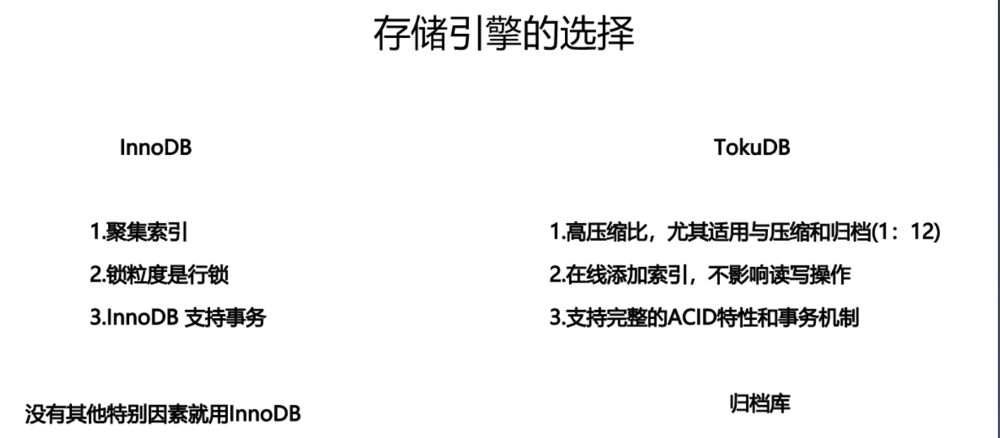
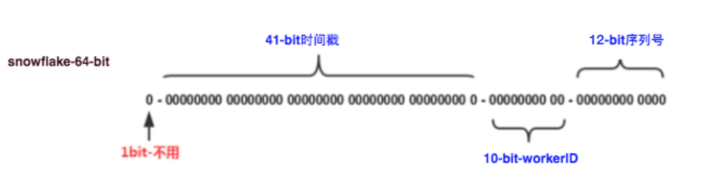

[TOC]

# 1.MySQL 事务与锁* 

## MySQL 事务

事务可靠性模型 ACID:
•Atomicity: 原子性, 一次事务中的操作要么全部成功, 要么全部失败。 

•Consistency: 一致性, 跨表、跨行、跨事务, 数据库始终保持一致状态。 

•Isolation: 隔离性, 可见性, 保护事务不会互相干扰, 包含4种隔离级别。 

•Durability:, 持久性, 事务提交成功后,不会丢数据。如电源故障, 系统崩溃。

事务不同级别是在平衡性能和数据可靠性。

InnoDB:
双写缓冲区、故障恢复、操作系统、fsync() 、磁盘存储、缓存、UPS、网络、备份策略 ......

### 表级锁

意向锁: 表明事务稍后要进行哪种类型的锁定。意向锁用于在表级别快速判断行锁冲突，提升性能。

•共享意向锁(IS): 打算在某些行上设置共享锁 

•排他意向锁(IX): 打算对某些行设置排他锁 

•Insert 意向锁: Insert 操作设置的间隙锁 

其他
• 自增锁(AUTO-IN) 

•LOCK TABLES（整个表锁）/DDL（metadata lock）

### 行级锁(InnoDB)
•记录锁(Record): 始终锁定索引记录，注意隐藏的聚簇索引;
• 间隙锁(Gap): 锁住一个范围
•临键锁(Next-Key): 记录锁+间隙锁的组合; 可“锁定”表中不存在记录 

•谓词锁(Predicat): 空间索引

#### 死锁: 

mysql有两种机制处理死锁：

​	1、默认死锁检测。缺点：循环检测，时间复杂度问题..

​	2、锁超时机制。缺点：容易影响正常长事务操作。

show engine innodb status

-阻塞与互相等待 

-增删改、锁定读（lock in share mode） 

-死锁检测与自动回滚

 -锁粒度与程序设计

### 隔离级别

《SQL:1992标准》规定了四种事务隔离级别(Isolation): 

• 读未提交: READ UNCOMMITTED
• 读已提交: READ COMMITTED
• 可重复读: REPEATABLE READ
• 可串行化: SERIALIZABLE 

事务隔离是数据库的基础特征。不同隔离级别是为了平衡性能和数据可靠性。
MySQL:
• 可以设置全局的默认隔离级别
• 可以单独设置会话的隔离级别
• InnoDB 实现与标准之间的差异。mysql采用MVCC机制。RC是每个语句开启一个事务视图，可重复读是开启事务时开启一个事务视图。

#### 读未提交: READ UNCOMMITTED
•很少使用
•不能保证一致性
•脏读(dirty read) : 使用到从未被确认的数
据(例如: 早期版本、回滚)
锁:
•以非锁定方式执行
•可能的问题: 脏读、幻读、不可重复读

#### 读已提交: READ COMMITTED
•每次查询都会设置和读取自己的新快照。
•仅支持基于行的 bin-log
•UPDATE 优化: 半一致读(semi-consistent read)
•不可重复读: 不加锁的情况下, 其他事务 UPDATE 或 DELETE 会对查询结果有影响 •幻读(Phantom): 加锁后, 不锁定间隙, 其他事务可以 INSERT。
锁:
•锁定索引记录, 而不锁定记录之间的间隙 

•可能的问题: 幻读、不可重复读

### 可重复读: REPEATABLE READ
•InnoDB 的默认隔离级别 

•使用事务第一次读取时创建的快照 

•多版本技术

锁:
•使用唯一索引的唯一查询条件时, 只锁定查找到的索引记录, 不锁定间隙。 

•其他查询条件, 会锁定扫描到的索引范围, 通过间隙锁或临键锁来阻止其他会话在这个
范围中插入值。

串行化: SERIALIZABLE
最严格的级别，事务串行执行，资源消耗最大;
问题回顾:
•脏读(dirty read) : 使用到从未被确认的数据(例如: 早期版本、回滚) 

•不可重复读: 不加锁的情况下, 其他事务 update 或 delete 会对结果集有影响 

•幻读(Phantom): 加锁之后, 相同的查询语句, 在不同的时间点执行时, 产生不同的
结果集

怎么解决? 

提高隔离级别、使用间隙锁或临键锁

#### undo log: 撤消日志

•保证事务的原子性

•用处: 事务回滚, 一致性读、崩溃恢复。 

•记录事务回滚时所需的撤消操作

•一条 INSERT 语句，对应一条 DELETE 的 undo log

•每个 UPDATE 语句，对应一条相反 UPDATE 的 undo log
保存位置:

•system tablespace (MySQL 5.7默认) 

•undo tablespaces (MySQL 8.0默认)

#### redo log: 重做日志
•确保事务的持久性，防止事务提交后数据未刷新到磁盘就掉电或崩溃。

•事务执行过程中写入 redo log,记录事务对数据页做了哪些修改。 

•提升性能: WAL(Write-Ahead Logging) 技术, 先写日志, 再写磁盘。

•日志文件: ib_logfile0, ib_logfile1 

•日志缓冲: innodb_log_buffer_size 

•强刷: fsync()

#### MVCC: 多版本并发控制

•使 InnoDB 支持一致性读: READ COMMITTED 和 REPEATABLE READ 。 

•让查询不被阻塞、无需等待被其他事务持有的锁，这种技术手段可以增加并发性能。 

•InnoDB 保留被修改行的旧版本。 

•查询正在被其他事务更新的数据时，会读取更新之前的版本。

•每行数据都存在一个版本号, 每次更新时都更新该版本 

•这种技术在数据库领域的使用并不普遍。 某些数据库, 以及某些 MySQL 存储引擎都不支持。

聚簇索引的更新 = 替换更新 二级索引的更新 = 删除+新建

#### MVCC 实现机制
•隐藏列

•事务链表， 保存还未提交的事务，事务提交则会从链表中摘除

•Read view: 每个 SQL 一个, 包括 rw_trx_ids, low_limit_id, up_limit_id, low_limit_no 等 

•回滚段: 通过 undo log 动态构建旧版本数据

# 2.DB 与 SQL 优化*

## 数据类型选择

需要根据字段大小和表规模估算存储占用，节省费用成本。

## 存储引擎选择

## 字符集选择

一般用Utf8mb4

## 避免索引数据类型隐式转换

varchar类型索引，传数值类型，mysql自己需要隐式转换。执行时导致不走索引。

## 通过slowlog 查询慢sql

优先优化频繁执行的sql，一般看超过1s的sql。

## 主键单调递增底层减少页分裂的问题

## 避免回表

## 联合索引优化排序

## 索引选择 

索引区分度

## 修改表结构

需要考虑MDL锁的问题。

## 总结1:写入优化

大批量写入的优化 

PreparedStatement 减少 SQL 解析 

Multiple Values/Add Batch 减少交互 

Load Data，直接导入

索引和约束问题

## 总结2:数据更新

数据的范围更新

注意 GAP Lock 的问题 

导致锁范围扩大

## 总结3:模糊查询

Like 的问题 

前缀匹配 

否则不走索引 

使用mysql全文检索功能

solr/ES(推荐)

## 总结4:连接查询

连接查询优化

驱动表的选择问题

避免笛卡尔积

## 总结5:索引失效

索引失效的情况汇总 

NULL，not，not in，函数等

减少使用 or，可以用 union(注意 union all 的区别)，以及前面提 到的like

大数据量下，放弃所有条件组合都走索引的幻想，出门左拐“全文检索”

必要时可以使用 force index 来强制查询走某个索引

## 总结6:查询 SQL 到底怎么设计?

查询数据量和查询次数的平衡 

避免不必须的大量重复数据传输 

避免使用临时文件排序或临时表 

分析类需求，可以用汇总表

# 3.常见场景分析*

## 怎么实现主键 ID

- 自增

- sequence（oracle）
- 模拟 seq（专门表模拟统一主键）
- UUID
- 时间戳/随机数 - snowflake

## 高效分页
- 分页:count/pageSize/pageNum, 带条件的查询语句
- 常见实现-分页插件:使用查询 SQL，嵌套一个 count，性能的坑? 
    - 改进一下1，重写 count （去掉join表的内容，只保留左表查询的count）
- 大数量级分页的问题，limit 100000,20
    - 改进一下2，反序
- 继续改进3，技术向:带 id， limit x,10 x为前一条满足条件的id。
- 继续改进4，需求向:非精确分页。在内存中缓存count，减少count次数
- 所有条件组合? 索引? 上es吧

## 乐观锁与悲观锁
select * from xxx for update update xxx
commit;
意味着什么?
select * from xxx
update xxx where value=oldValue 为什么叫乐观锁

## 补充：分布式自增id：snowflake、美团leaf 

> leaf介绍:https://tech.meituan.com/2017/04/21/mt-leaf.html
>
> 7种分布式id：https://www.cnblogs.com/chengxy-nds/p/12315917.html

snowflake id图。

- [ ] 每种分布式id算法的优缺点待详细研究。

### 个人总结多种分布式自增id方法的优缺点

**分布式ID需要满足那些条件？**

- 全局唯一：必须保证ID是全局性唯一的，基本要求
- 高性能：高可用低延时，ID生成响应要块，否则反倒会成为业务瓶颈
- 高可用：100%的可用性是骗人的，但是也要无限接近于100%的可用性
- 好接入：要秉着拿来即用的设计原则，在系统设计和实现上要尽可能的简单
- 趋势递增：最好趋势递增，减少mysql页分裂

1、单个数据库专用id生成表

优点：简单

缺点：并发受限。

2、号段表。每次业务取一批id。通过乐观锁保证不会取到重复的。

current_max_id  biz_id  version 

优点：减少了数据库访问。并发提高了

缺点：可能不连续。有些id会丢失

3、UUID

优点：简单。性能高

缺点：无法范围查询。页分裂严重。性能差。二级索引占用空间大。

4、数据库集群，

N台机器。 1从1开始，2从2开始...N从n开始。 自增的步长都是N

优点：比单机提高了并发

缺点：扩展集群难。

5、redis

优点：自增。连续

缺点：依赖redis的可用性。

6、snowflake

缺点：服务器时间同步时，如果时间回退，可能会有重复id出现的风险。解决办法：代码中判断如果小于已有最大id，时间短的话wait一下，时间长的话则直接抛出异常并告警。

