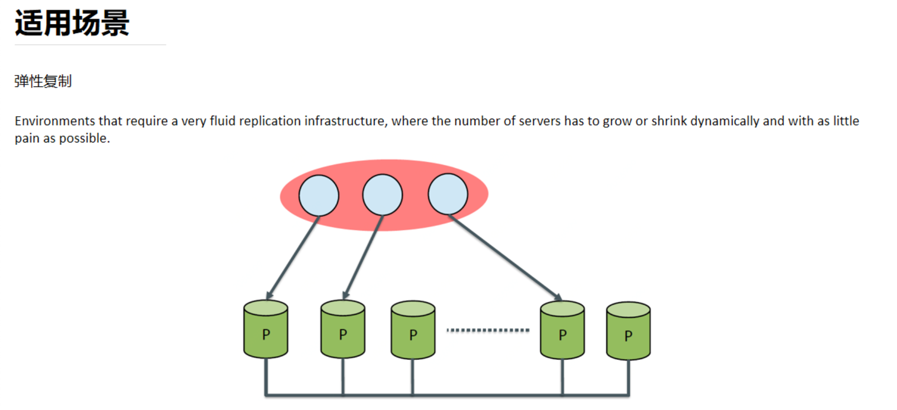

[TOC]

# 超越分库分表-高可用与读写分离

## 1. 从单机到集群 

### 单机 MySQL 数据库的几个问题

随着数据量的增大，读写并发的增加，系统可用性要求的提升，单机 MySQL 面临: 

1、容量有限，难以扩容

2、读写压力，QPS 过大，特别是分析类需求会影响到业务事务 

3、可用性不足，宕机问题

### 单机 MySQL 的技术演进(解决三个问题)

* 读写压力问题：通过多机集群、读写分离和主从复制改善

* 主库高可用性：通过故障时主从切换实现。

* 数据库容量问题：通过数据库拆分（垂直拆分：按照业务拆分。水平拆分：分库分表）

    带来了数据一致性问题，需要分布式事务解决。

## 2.MySQL 主从复制* 

目前大部分公司还在用传统异步复制，少量公司用组复制。

### 主从复制原理

核心是

1、主库写 binlog 

2、从库 relay log

2000年，MySQL 3.23.15版本引入了复制

2002年，MySQL 4.0.2版本分离 IO 和 SQL 线程，引入了 relay log 

2010年，MySQL 5.5版本引入半同步复制

2016年，MySQL 在5.7.17中引入 InnoDB Group Replication

主库有个dump线程会把binlog发给slave，slave收到通过事件形式用IO线程写到自己的relay log，sql线程读取relay log写入到库里。

#### Binlog 格式

* ROW
* statement
* Mixed

>  查看binlog文件内容的命令：mysqlbinlog -vv xxxx

#### 异步复制

异步复制:传统主从复制--2000年，MySQL 3.23.15版本引入了 Replication

主库异步向从库同步数据，和自己的数据事务没有关系。

#### 半同步复制

需要启用插件。

当至少有一个从库返回确认ACK之后，主库才会提交。保证至少有一个从库和主库数据保持一致。

#### 组复制

基于paxos协议，主节点向从节点同步数据，只要有超过半数的从节点返回了，主节点就可以提交事务。

### 主从复制演示

1、本地启动两个 MySQL 

2、注意配置文件(思考几种安装、启动方式) 

4、演示数据复制操作，创建表和写入、修改数据

本地通过mysqld命令指定两个配置文件，就可以启动两个mysql。

具体配置参考：musql主从复制文档。

my.cnf配置：

> 注意：两个mysql的datadir和socket、port要不同
>
> socket代表服务可以直接通过socket通信，而不是通过TCP。

用docker的话 docker exec -it name /bin/bash 

### 主从复制的局限性

1、主从延迟问题 

2、应用侧需要配合读写分离框架 

3、不解决高可用问题

## 3.MySQL 读写分离* 

### 主从复制在业务系统里的应用

借助于主从复制，我们现在有了多个 MySQL 服务器示例。 

如何借助这个新的集群，改进我们的业务系统数据处理能力? 

== > 配置多个数据源，实现读写分离

### 读写分离-动态切换数据源版本1.0

1、基于 Spring/Spring Boot，配置多个数据源(例如2个，master 和 slave)

2、根据具体的 Service 方法是否会操作数据，注入不同的数据源,1.0版本 

3、改进一下1.1:基于操作 AbstractRoutingDataSource 和自定义注解 readOnly 之
类的，简化自动切换数据源 

4、改进二下1.2:支持配置多个从库; 

5、改进三下1.3:支持多个从库的负载均衡。 今天的作业之一。

### 读写分离-数据库框架版本2.0

1、分析前一版本“动态切换数据源”有什么问题? 

1)侵入性还是较强 

2)降低侵入性会导致”写完读”不一致问题(insert和select在一个事务里，可能出现一个在主，一个在从执行，主从延迟导致不一致)

2、改进方式，ShardingSphere-jdbc 的 Master-Slave 功能 

1)SQL 解析和事务管理，自动实现读写分离 

2)解决”写完读”不一致的问题

今天作业之一:使用 ShardingSphere-jdbc 5.0.0-alpha 实现读写分离配置。

### 读写分离-数据库中间件版本3.0

1、分析前一版本“框架版本”有什么问题? 

1)对业务系统还是有侵入 

2)对已存在的旧系统改造不友好

解决：可以使用中间件的形式。

2、改进方式，MyCat/ShardingSphere-Proxy 的 Master-Slave 功能 

1)需要部署一个中间件，规则配置在中间件

2)模拟一个 MySQL 服务器，对业务系统无侵入

今天作业之一:使用 ShardingSphere-proxy 5.0.0-alpha 实现读写分离配置。

## 4.MySQL 高可用*

### 为什么要高可用

1、读写分离，提升读的处理能力 

2、故障转移，提供 failover 能力

加上业务侧连接池的心跳重试，实现断线重连，业务不间断，降低 RTO 和 RPO。

### 高可用定义

高可用意味着，更少的不可服务时间。一般用SLA/SLO衡量。 1年 = 365天 = 8760小时

99 = 8760 * 1% = 8760 * 0.01 = 87.6小时

99.9 = 8760 * 0.1% = 8760 * 0.001 = 8.76小时

99.99 = 8760 * 0.0001 = 0.876小时 = 0.876 * 60 = 52.6分钟 99.999 = 8760 * 0.00001 = 0.0876小时 = 0.0876 * 60 = 5.26分钟

后面的分布式课程讲稳定性，注意关系和区别。

### 为什么要高可用

什么是 failover(故障转移)，故障转移，灾难恢复 

容灾:热备与冷备 

对于主从来说，简单讲就是主挂了，某一个从，变成主， 

整个集群来看，正常对外提供服务

常见的一些策略: 

​	1、多个实例不在一个主机/机架上 

​	2、跨机房和可用区部署 

​	3、两地三中心容灾高可用方案

### MySQL 高可用0:主从手动切换

如果主节点挂掉，将某个从改成主; 

重新配置其他从节点。 

修改应用数据源配置。

有什么问题?

1. 可能数据不一致。（宕机时从库没收到最新的数据，主节点修复完成后，两个数据还要人工处理）
2. 需要人工干预。
3. 代码和配置的侵入性。

### MySQL 高可用1:主从手动切换

用 LVS+Keepalived 实现多个节点的探活+请求路由。

配置 VIP 或 DNS 实现配置不变更。 

有什么问题?

1. 手工处理主从切换
2. 大量的配置和脚本定义（实现主从切换）

### MySQL 高可用2:MHA

MHA(Master High Availability)目前在 MySQL 高可用方面是一个相对成熟的解决方 案，它由日本 DeNA 公司的 youshimaton(现就职于 Facebook 公司)开发，是一套 优秀的作为 MySQL 高可用性环境下故障切换和主从提升的高可用软件。
基于 Perl 语言开发，一般能在30s内实现主从切换。 切换时，直接通过 SSH 复制主节点的日志。

有什么问题?

1. 需要配置 SSH 信息 
2. 至少3台

### MySQL 高可用3:MGR *

如果主节点挂掉，将自动选择某个从改成主;
无需人工干预，基于组复制，保证数据一致性。

有什么问题?

1. 外部获得状态变更需要读取数据库。 
2. 外部需要使用 LVS/VIP 配置。

### MySQL 高可用4:MySQL Cluster

### MySQL 高可用5:Orchestrator

如果主节点挂掉，将某个从改成主;

基于 Go 语言开发，实现了中间件本身的高可用(?!)

