# 分布式事务

## 0.sharding-scaling 迁移demo

> 官方文档：https://shardingsphere.apache.org/document/current/cn/user-manual/shardingsphere-scaling/

## 1. 分布式事务*

### 为什么需要分布式事务

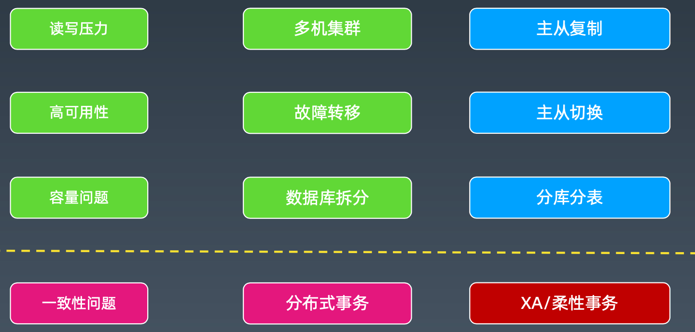

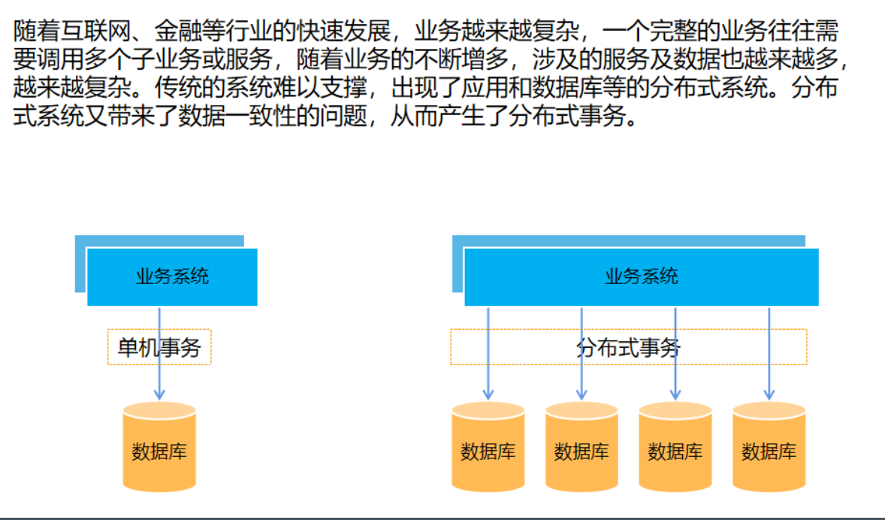

### 什么叫分布式事务

分布式条件下，多个节点操作的整体事务一致性。

特别是在微服务场景下，业务 A 和业务 B 关联，事务 A 成功，事务 B 失败，由于跨系统， 就会导致不被感知。此时从整体来看，数据是不一致的。

### 如何实现分布式下的一致性

典型情况下是两个思路:

1、理想状态:直接想单机数据库事务一样，多个数据库自动通过某种协调机制，实现了 跨数据库节点的一致性。

使用场景:要求严格的一致性，比如金融交易类业务。

2、一般情况:可以容忍一段时间的数据不一致，最终通过超时终止，调度补偿，等等方 式，实现数据的最终状态一致性。

使用场景:准实时或非实时的处理，比如 T+1 的各类操作，或者电商类操作。

1、强一致 : XA

2、弱一致 :

1) 不用事务，业务侧补偿冲正
2) 所谓的柔性事务，使用一套事务框架保证最终一致的事务

## 2.XA 分布式事务*

### XA 分布式事务协议

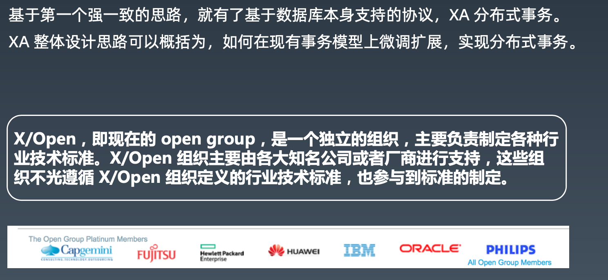

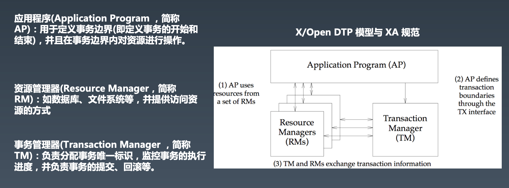

### XA 分布式事务协议

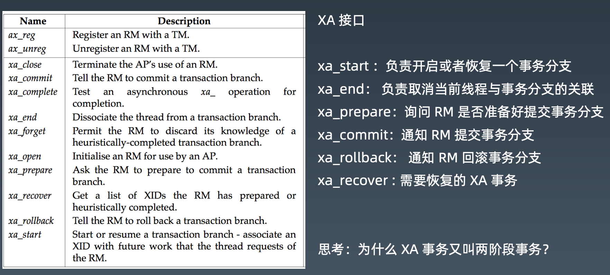

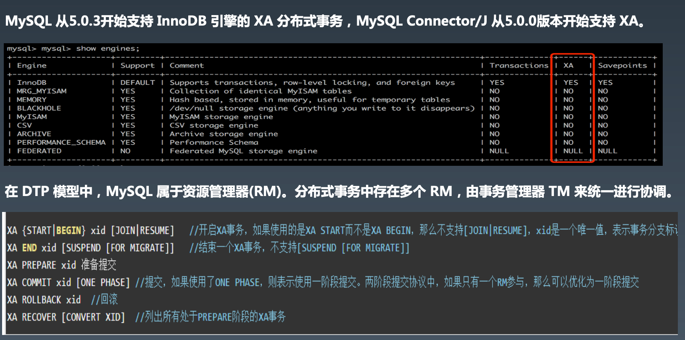

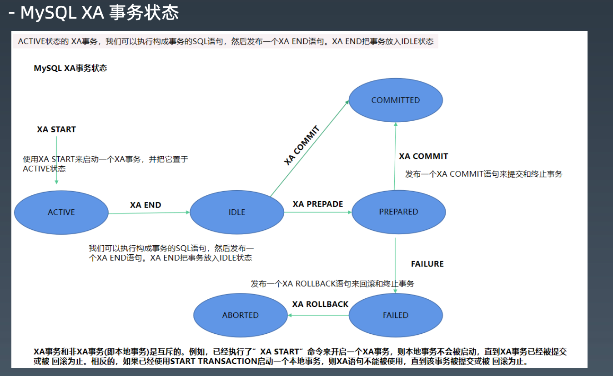

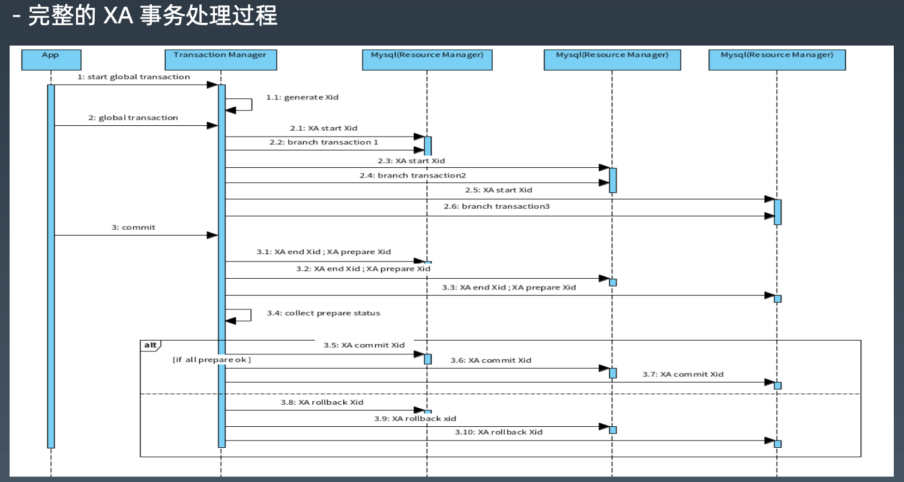

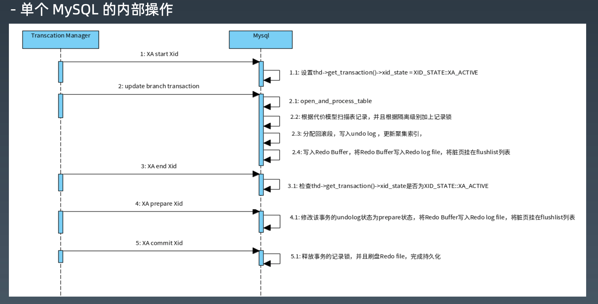

- 思考一个问题:XA 过程中，事务失败怎么办?

  1、业务 SQL 执行过程，某个 RM 崩溃怎么处理?  回滚。

  2、全部 prepare 后，某个 RM 崩溃怎么处理?  全部提交或回滚，这个RM重启的时候自己再commit或回滚。

  3、commit 时，某个 RM 崩溃怎么办? 这个RM重启的时候自己再commit

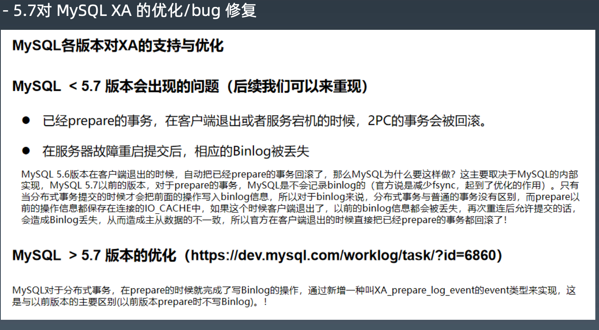

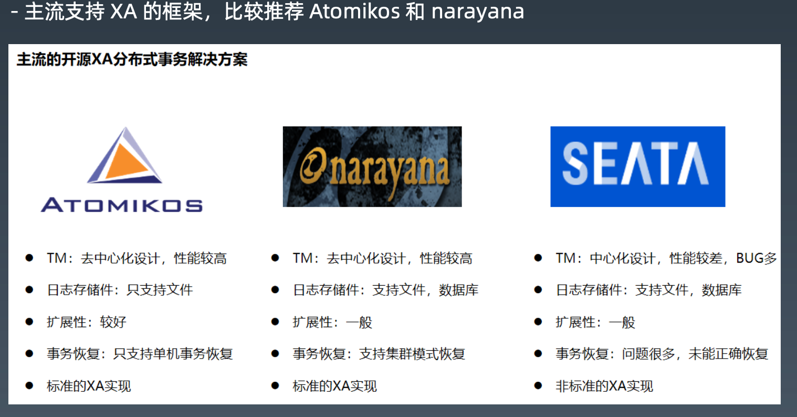

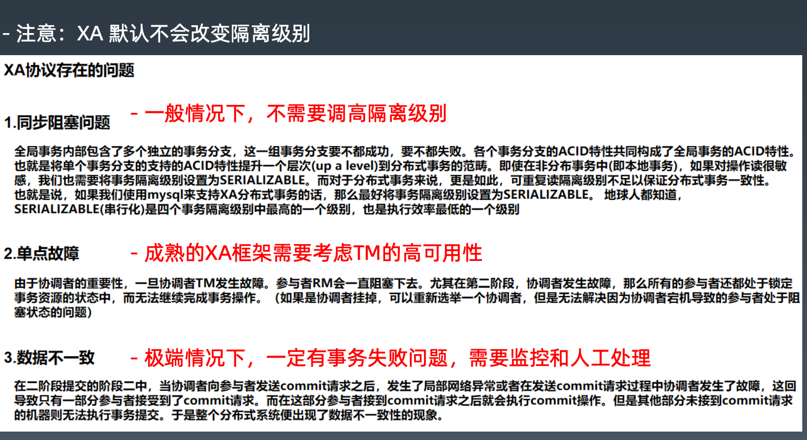

## 3.BASE 柔性事务*

本地事务 -> XA(2PC) -> BASE

如果将实现了 ACID 的事务要素的事务称为刚性事务的话，那么基于 BASE 事务要素的事务则称 为柔性事务。 BASE 是基本可用、柔性状态和最终一致性这三个要素的缩写。

• 基本可用(Basically Available)保证分布式事务参与方不一定同时在线。

• 柔性状态(Soft state)则允许系统状态更新有一定的延时，这个延时对客户来说不一定能够
察觉。

• 而最终一致性(Eventually consistent)通常是通过消息传递的方式保证系统的最终一致性。

在 ACID 事务中对隔离性的要求很高，在事务执行过程中，必须将所有的资源锁定。 柔性事务的 理念则是通过业务逻辑将互斥锁操作从资源层面上移至业务层面。通过放宽对强一致性要求， 来换取系统吞吐量的提升。

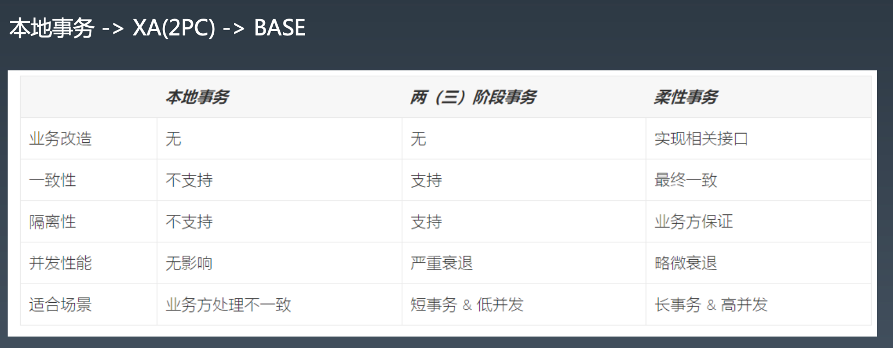

### BASE 柔性事务常见模式

1、TCC 

通过手动补偿处理

2、AT 

通过自动补偿处理

## 4.TCC/AT 以及相关框架* 

### 什么是 TCC 

BASE 柔性事务 TCC

TCC 模式即将每个服务业务操作分为两个阶段，第一个阶段检查并预留相关资源，第二阶段根据所有 服务业务的 Try 状态来操作，如果都成功，则进行 Confirm 操作，如果任意一个 Try 发生错误，则 全部 Cancel。

TCC 使用要求就是业务接口都必须实现三段逻辑:

1.准备操作 Try:完成所有业务检查，预留必须的业务资源。

2.确认操作 Confirm:真正执行的业务逻辑，不做任何业务检查，只使用 Try 阶段预留的业务资源 。因此，只要 Try 操作成功，Confirm 必须能成功。另外，Confirm 操作需满足幂等性，保证一 笔分布式事务能且只能成功一次。

3.取消操作 Cancel:释放 Try 阶段预留的业务资源。同样的，Cancel 操作也需要满足幂等性。

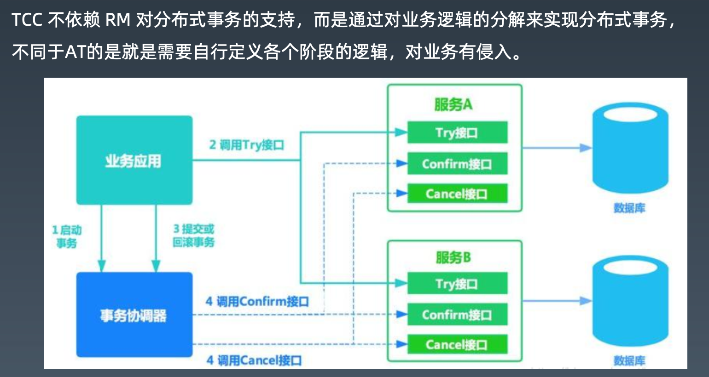

TCC 需要注意的几个问题:

1、允许空回滚 

2、防悬挂控制 

3、幂等设计

### 什么是 SAGA

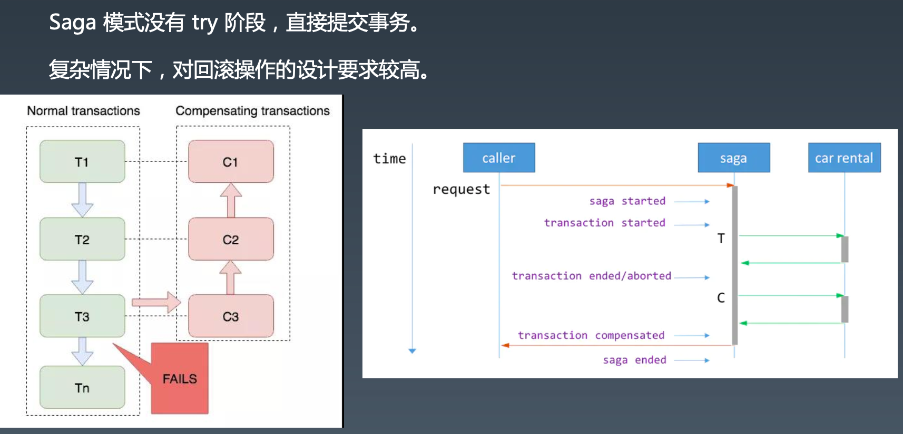

### 什么是 AT(自动化事务)

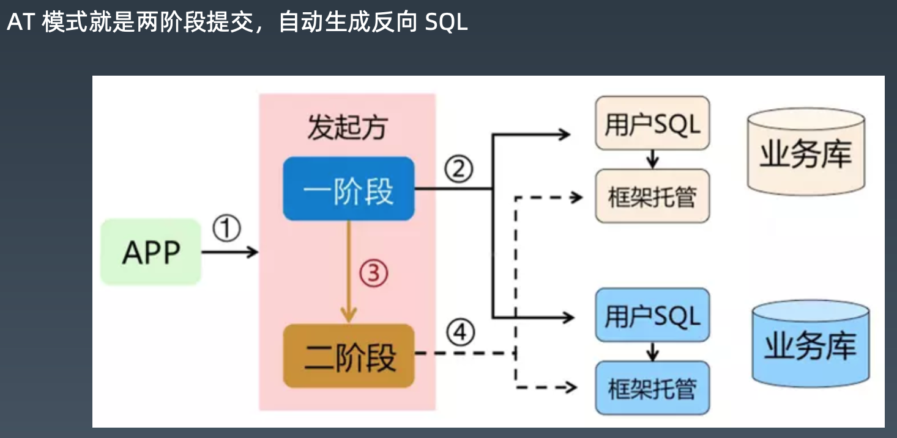

### 柔性事务下隔离级别

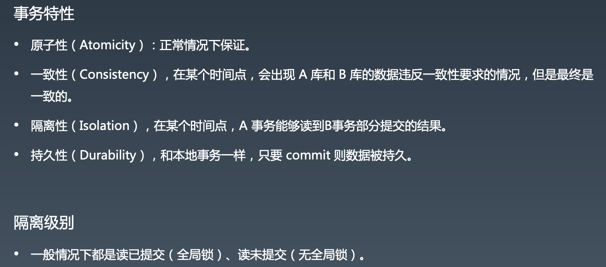

### Seata

Seata-TCC/AT 柔性事务

Seata 是阿里集团和蚂蚁金服联合打造的分布式事务框架。 其 AT 事务的目标是在微服 务架构下，提供增量的事务 ACID 语意，让开发者像使用本地事务一样，使用分布式事 务，核心理念同 Apache ShardingSphere 一脉相承。

Seata AT 事务模型包含TM (事务管理器)，RM (资源管理器) 和 TC (事务协调器)。 TC 是 一个独立部署的服务，TM 和 RM 以 jar 包的方式同业务应用一同部署，它们同 TC 建立 长连接，在整个事务生命周期内，保持远程通信。 TM 是全局事务的发起方，负责全局 事务的开启，提交和回滚。 RM 是全局事务的参与者，负责分支事务的执行结果上报， 并且通过 TC 的协调进行分支事务的提交和回滚。

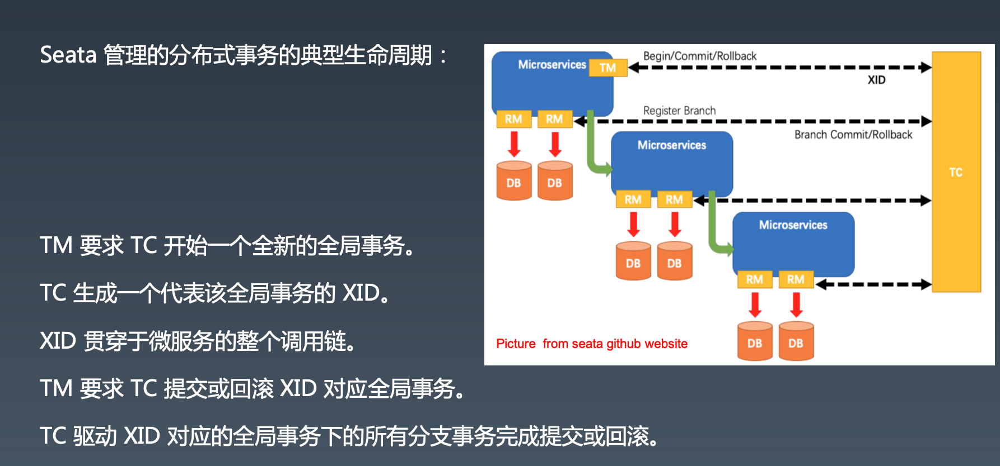

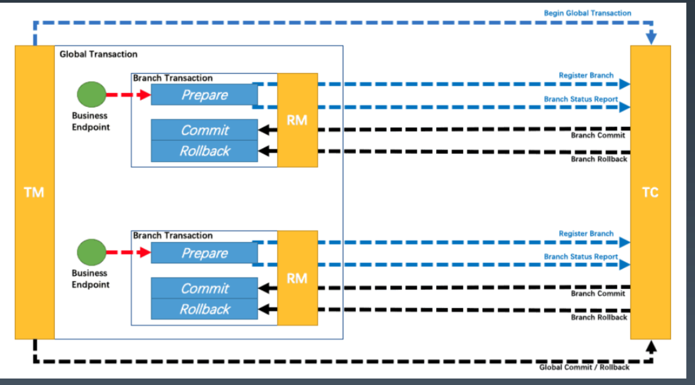

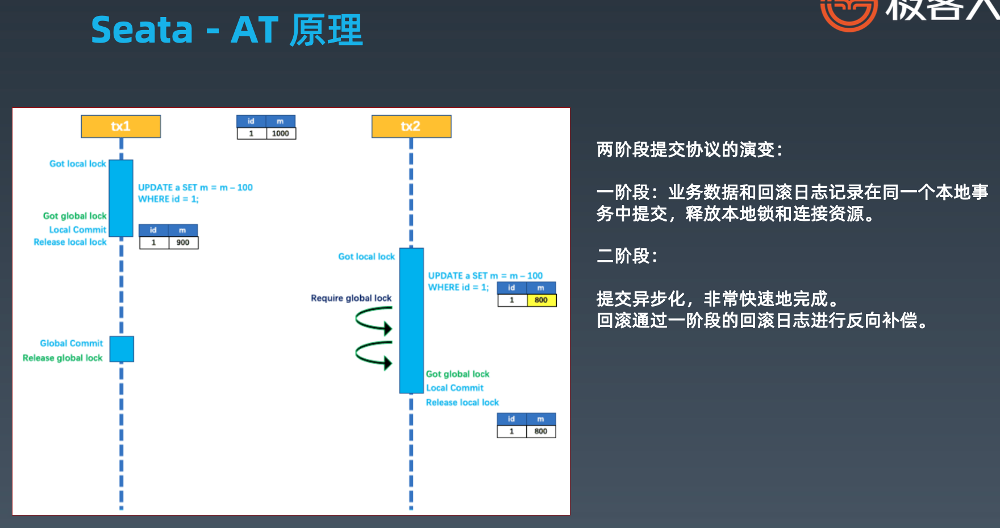

## 5.ShardingSphere 对分布式事务的支持 

## 6. 总结回顾与作业实践

