[TOC]

# 超越分库分表-数据库拆分与分库分表

## 1.为什么要做数据库拆分* 

### 单机 MySQL 的技术演进

拆分主要解决的单机单库单表的容量问题。

拆分之后，吞吐量上升了，但是对于简单的查询延迟一定是增加了的。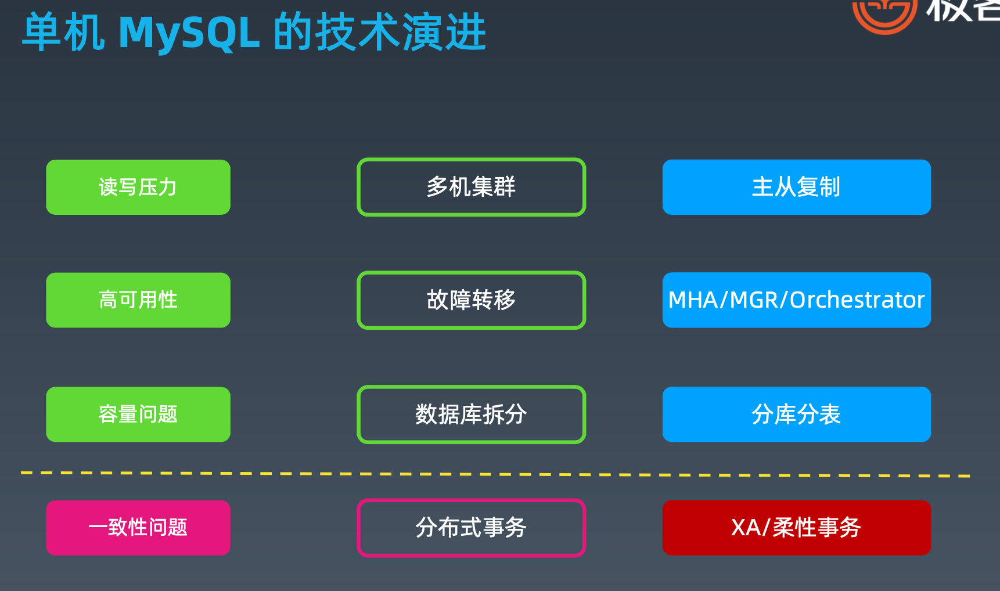

### 单机数据库已经无法适应互联网的发展

业务飞速发展导致了数据规模的急速膨胀，单机数据库已经无法适应互联网业务的发展

传统的将数据集中存储至单一数据节点的解决方案，在容量、性能、可用性和运维成本这三方面已经难于满足 互联网的海量数据场景。我们在单库单表数据量超过一定容量水位的情况下，索引树层级增加，磁盘 IO 也很 可能出现压力，会导致很多问题。

从性能方面来说，由于关系型数据库大多采用 B+树类型的索引，在数据量超过阈值的情况下，索引深度的增 加也将使得磁盘访问的 IO 次数增加，进而导致查询性能的下降;同时，高并发访问请求也使得集中式数据库 成为系统的最大瓶颈。

从可用性的方面来讲，服务化的无状态型，能够达到较小成本的随意扩容，这必然导致系统的最终压力都落在 数据库之上。而单一的数据节点，或者简单的主从架构，已经越来越难以承担。从运维成本方面考虑，当一个 数据库实例中的数据达到阈值以上，数据备份和恢复的时间成本都将随着数据量的大小而愈发不可控。

### 数据量太大导致的几个问题

1、无法执行 DDL，比如添加一列，或者增加索引，都会直接影响线上业务，导致长时间的数据库无响应。

2、无法备份，与上面类似，备份会自动先 lock 数据库的所有表，然后导出数据，量大了就没法执行了。

3、影响性能与稳定性，系统越来越慢，随时可能会出现主库延迟高，主从延迟很高， 且不可控，对业务系统有极大的破坏性影响。

### 从读写分离到数据库拆分

主从结构解决了高可用，读扩展，但是单机容量不变，单机写性能无法解决。 

提升容量-->分库分表，分布式，多个数据库，作为数据分片的集群提供服务。 

降低单个节点的写压力。

提升整个系统的数据容量上限。

### 扩展立方体

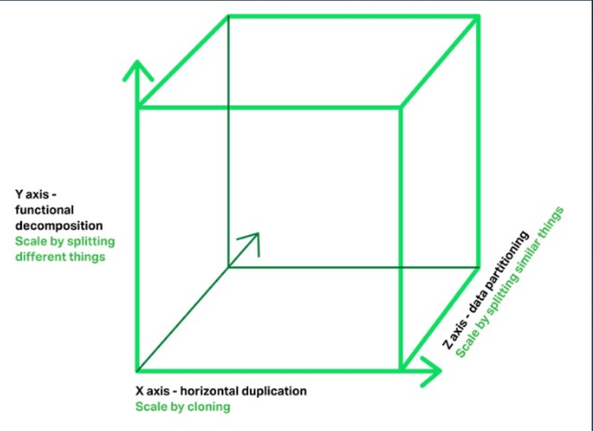

X 轴:通过 clone 整个系统复制，集群 

Y 轴:通过解耦不同功能复制，业务拆分 

Z 轴:通过拆分不同数据扩展，数据分片

### 数据库/数据的扩展

## 2.数据库垂直拆分*

### 垂直拆分-以淘宝的服务化为例

典型：07-08年淘宝开始做

垂直分库分表 => 分布式服务化 => 微服务架构

### 拆库

垂直拆分(拆库):将一个数据库，拆分成多个提供不同业务数据处理能力的数据库。

老系统的关联查询SQL修改。

### 拆表

垂直拆分(拆表):如果单表数据量过大，还可能需要对单表进行拆分。

比如一个 200 列的订单主表，拆分成十几个子表:订单表、订单详情表、订单收件信息表、订单支付表、订单产品快照表等等。这个对业务系统的影响有时候可能会大到跟新作一个系统差 不多。对于一个高并发的线上生产系统进行改造，就像是给心脑血管做手术，动的愈多，越核 心，出现大故障的风险越高。

所以，我们一般情况下，尽量少用这种办法。除非垂直拆库等手段已经都采取了，仍然存在大表性能问题。

### 垂直拆分的优缺点

优点：

1、单库(单表)变小，便于管理和维护 

2、对性能和容量有提升作用 

3、改造后，系统和数据复杂度降低 

4、可以作为微服务改造的基础

缺点：

1、库变多，管理变复杂 

2、对业务系统有较强的侵入性 

3、改造过程复杂，容易出故障 

4、拆分到一定程度就无法继续拆分

### 垂直拆分的一般做法

1、梳理清楚拆分范围和影响范围 

2、检查评估和重新影响到的服务 

3、准备新的数据库集群复制数据 

4、修改系统配置并发布新版上线

注意: 1、先拆分系统，还是先拆分数据库? 系统

2、先拆分多大范围?

## 3.数据库水平拆分*

### 什么是水平拆分

水平分库分表 

分为，分库、分表、分库分表三类 

有什么区别?

三类都在什么场景下使用？

单库压力不大，但是单表数据量大时，可以只分表

单库压力大，表数据量大，分库分表。

单库压力大，表数据量小，只分库。

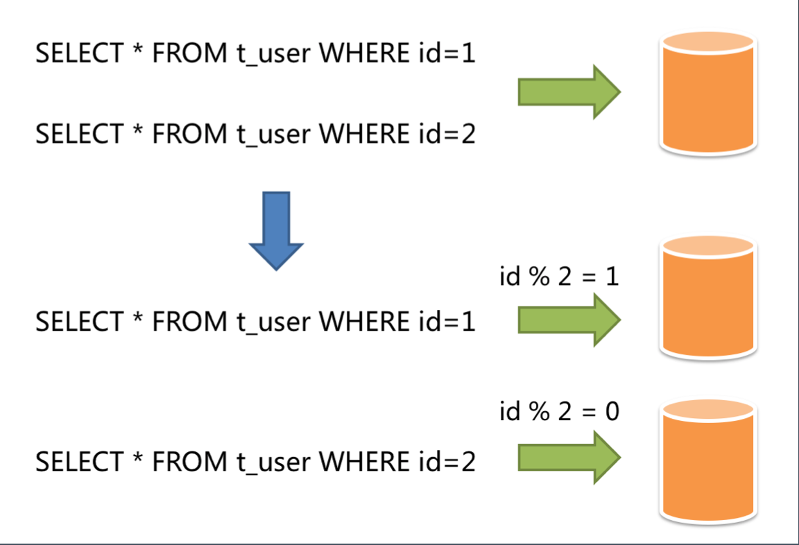

### 数据库水平拆分

#### 按主键分库分表

水平拆分(按主键分库分表):水平拆分就是直接对数据进行分片，有分库和分表两个具体方 式，但是都只是降低单个节点数据量，但不改变数据本身的结构。这样对业务系统本身的代码 逻辑来说，就不需要做特别大的改动，甚至可以基于一些中间件做到透明。

比如把一个 10 亿条记录的订单单库单表(orderDB 库 t_order 表)。我们按照用户 id 除以 32 取模，把单库拆分成 32 个库orderDB_00..31;再按订单 id 除以 32 取模，每个库里再拆 分成 32 个表t_order_00..31。这样一共是 1024 个子表，单个表的数据量就只是 10 万条了 。

一个查询如果能够直接路由到某个具体的字表，比如orderDB05.t_order_10 ，那么查询效率 就会高很多。

#### 按时间分库分表

水平拆分(按时间分库分表):很多时候，我们的数据是有时间属性的，所以自然可以按照时 间维度来拆分。比如当前数据表和历史数据表，甚至按季度，按月，按天来划分不同的表。这 样我们按照时间维度来查询数据时，就可以直接定位到当前的这个子表。更详细的分析参考下 一个小节。
强制按条件指定分库分表:比如配置好某些用户的数据进入单独的库表，其他数据默认处理。 自定义方式分库分表:指定某些条件的数据进入到某些库或表。

思考一个问题:
为什么有些 DBA 不建议分表，只建议分库? (一些中间件，也只支持分库，不能分表)

因为考虑到分表还在一个库实例上，单机IO压力还是没有减少。

### 分库还是分表，如何选择

一般情况下，如果数据本身的读写压力较大，磁盘 IO 已经成为瓶颈，那么分库比分表要好。 分库将数据分散到不同的数据库实例，使用不同的磁盘，从而可以并行提升整个集群的并行数 据处理能力。相反的情况下，可以尽量多考虑分表，降低单表的数据量，从而减少单表操作的 时间，同时也能在单个数据库上使用并行操作多个表来增加处理能力。

### 数据库水平拆分分库分表的优缺点

优点: 

1、解决容量问题 

2、比垂直拆分对系统影响小 

3、部分提升性能和稳定性

缺点：

1、集群规模大，管理复杂

2、复杂 SQL 支持问题(业务侵入性、性能) 

3、数据迁移问题

4、一致性问题

### 分库分表演示

以 ShardingSphere-Proxy 为例。 

按用户分库，按订单分表(为什么这么做)。

思考一下，分库分表条件写成: 

分库 user_id % 2
分表 user_id % 2

会发生什么 ?

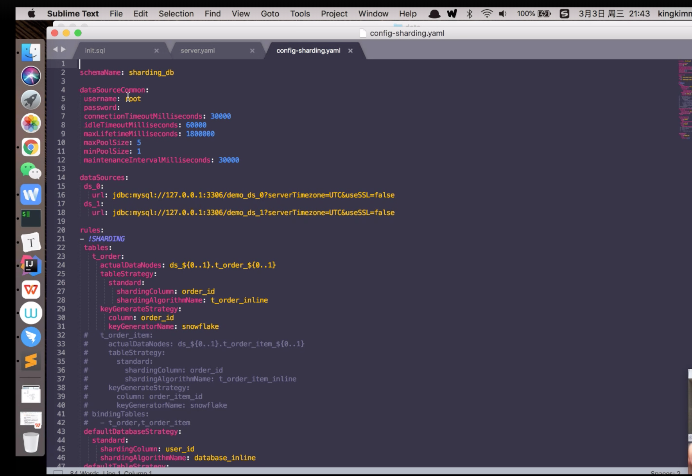

> 用户订单表：按照用户id取模划分库，再按照订单id取模划分表。这样便于用户查询自己的订单中心。
>
> 
>
> 如何解决卖家查询的问题？
>
> 异步同步数据到卖家单独的数据库，以卖家的用户id和订单id取模。（淘宝处理方式）和买家库的数据不一致的情况一般较小，延迟毫秒级别。

### 数据的分类管理

#### 将热数据库中很少使用的历史数据移动到冷数据库里，归档备份。

通过分类处理提升数据管理能力 随着我们对业务系统、对数据本身的进一步了解，我们就会发现，很多数据对质量的要求是不同的。

比如，订单数据，肯定一致性要求最高，不能丢数据。而日志数据和一些计算的中间数据，我们则是可以不要那么高的一致性，丢了不要了，或者从别的地方找回来。

同样地，我们对于同样一张表里的订单数据，也可以采用不同策略，无效订单如果比较多，我 们可以定期的清除或者转移(一些交易系统里有 80%以上是的机器下单然后取消的无意义订单 ，没有人会去查询它，所以可以清理)。

如果没有无效订单，那么我们也可以考虑:
1. 最近一周下单但是未支付的订单，被查询和支付的可能性较大，再长时间的订单，我们可 以直接取消掉。
2. 最近 3 个月下单的数据，被在线重复查询和系统统计的可能性最大。
3. 超过 3 个月、3 年以内的数据，查询的可能性非常小，我们可以不提供在线查询。
4. 3 年以上的数据，我们可以直接不提供任何方式的查询。

这样的话，我们就可以采取一定的手段去优化系统:
1. 定义一周内下单但未支付的数据为热数据，同时放到数据库和内存;
2. 定义三个月内的数据为温数据，放到数据库，提供正常的查询操作;
3. 定义 3 个月到 3 年的数据，为冷数据，从数据库删除，归档到一些便宜的磁盘，用压缩的
方式(比如 MySQL 的 tokuDB 引擎，可以压缩到几十分之一)存储，用户需要邮件或者提
交工单来查询，我们导出后发给用户;
4. 定义 3 年以上的数据为冰数据，备份到磁带之类的介质上，不提供任何查询操作。
我们可以看到，上面都是针对一些具体场景，来分析和给出解决办法。那么通过在各种不同的 场景下，都对现有的技术和手段进行一些补充，我们就会逐渐得到一个复杂的技术体系。

## 4.相关的框架和中间件* 

### 框架和中间件

Java 框架层面:

- TDDL 淘宝数据中间层（读写分离，分库分表）
- Apache ShardingSphere-JDBC（读写分离，分库分表，加解密、分布式主键生成）

中间件层面:

- DRDS(商业闭源)
- Apache ShardingSphere-Proxy 
- MyCat/DBLE
- Cobar
- Vitness（go语言）
- KingShard（go语言）

### 数据库中间件的技术演进

数据爆炸增长，单机性能跟不上推动中间件技术发展

#### 分布式带来的问题：cap无法同时满足

一致性、高可用性、分区容错性。不同的中间件和数据库在这三个之间做平衡。

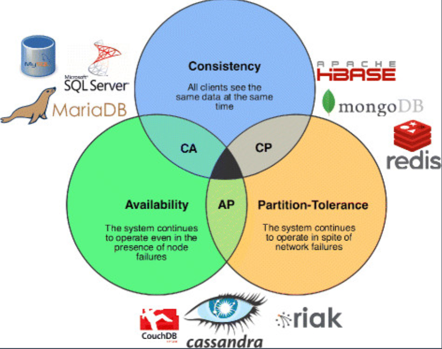

#### 演进过程：从框架类库-》中间件-》分布式数据库、数据网格

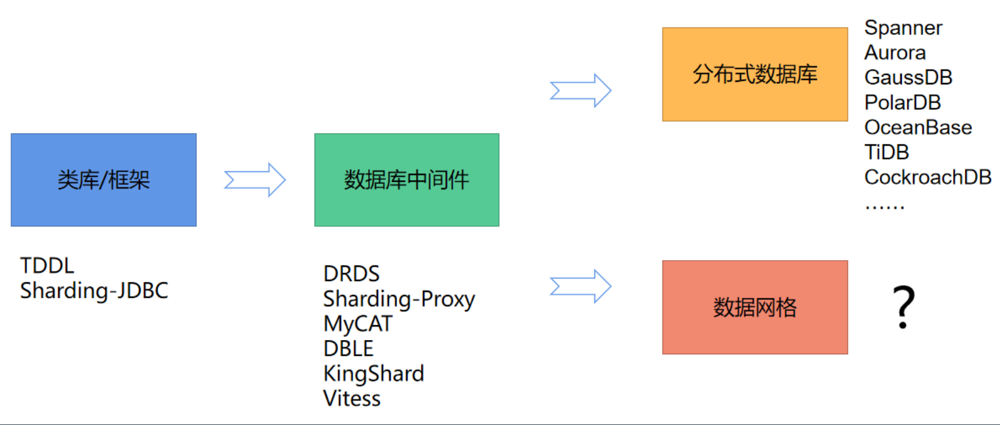

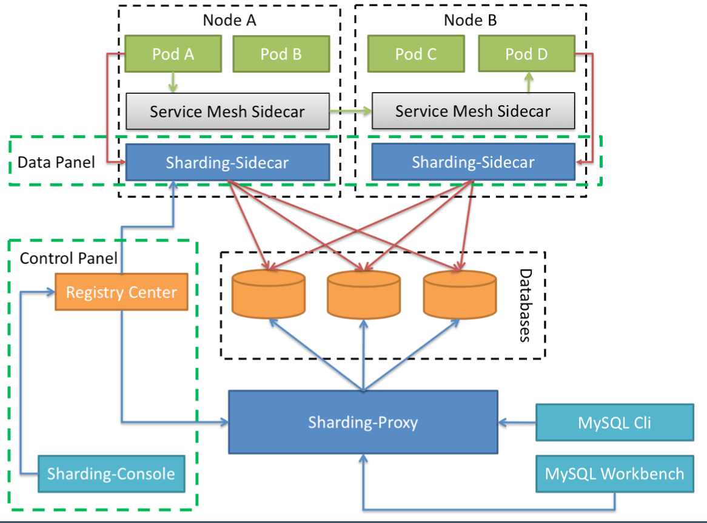

### 数据库中间件 ShardingSphere

Apache ShardingSphere 是一套开源的分布式数据库中间件解决方案组成的生态圈， 它由 JDBC、Proxy 和 Sidecar(规划中)这 3 款相互独立，却又能够混合部署配合使用 的产品组成。 它们均提供标准化的数据分片、分布式事务和数据库治理功能，可适用于 如 Java 同构、异构语言、云原生等各种多样化的应用场景。

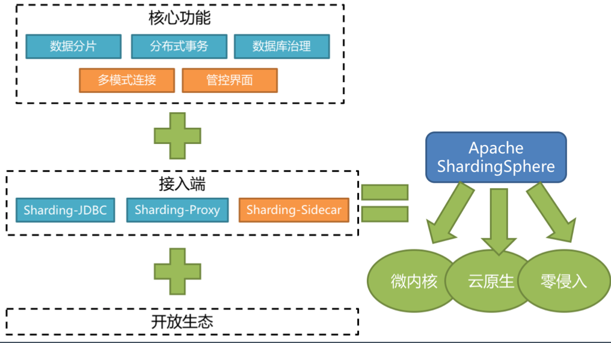

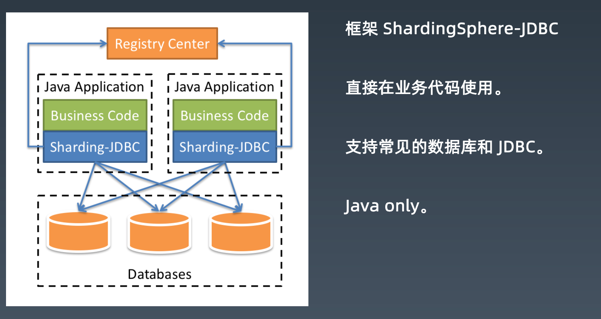

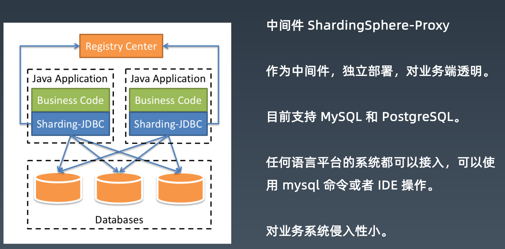

## 5. 如何做数据迁移

### 数据迁移是重要的一环

- 设计新系统容易，但是我们处理的都是老系统和历史数据 
- 怎么能更平滑的迁移旧数据到新的数据库和系统
- 特别是在异构的数据库结构情况下
- 达到数据准确，迁移速度快，减少停机，对业务影响小

### 数据迁移的方式:全量

- 全量数据导出和导入 

  1、业务系统停机， 

  2、数据库迁移，校验一致性， 

  3、然后业务系统升级，接入新数据库。

  

  直接复制的话，可以 dump 后全量导入 

  (如果是)异构数据，需要用程序来处理

优点：实现简单

缺点：停机时间长

### 数据迁移的方式:全量+增量

- 依赖于数据本身的时间戳 

    1、先同步数据到最近的某个时间戳 

    2、然后在发布升级时停机维护，

     3、再同步最后一段时间(通常是一天)的变化数据。 

    4、最后升级业务系统，接入新数据库。

优点：停机时间短

缺点：从库中查数据影响线上的QPS/TPS。

### 数据迁移的方式:binlog+全量+增量

- 通过主库或者从库的 binlog 来解析和重新构造数据，实现复制。

- 一般需要中间件等工具的支持。

  可以实现多线程，断点续传，全量历史和增量数据同步。

  继而可以做到:
  1、实现自定义复杂异构数据结构;（自己解析binlog做分库分表）
  2、实现自动扩容和缩容，比如分库分表到单库单表，单库单表到分库分表，分4个库表 到分64个库表。

  优点: 1、不影响主业务库2、实现扩容、缩容；3、自定义异构表结构

  缺点: 复杂

### 迁移工具 ShardingSphere-scaling

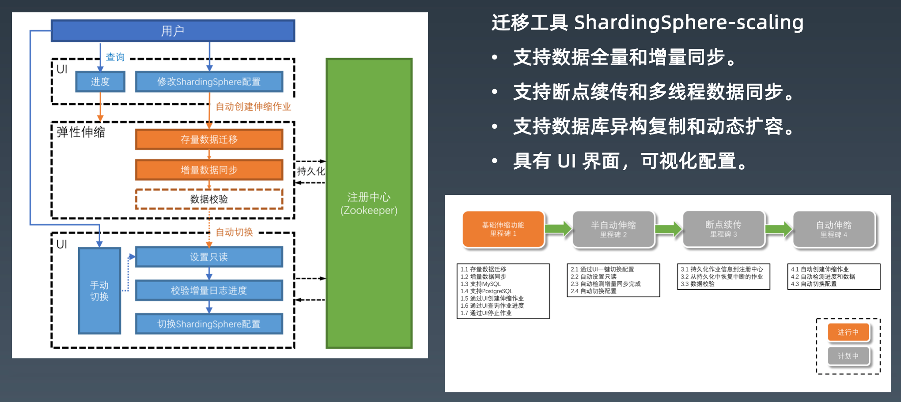

### 分库分表演示

以 ShardingSphere-Scaling 为例。 

演示数据异构复制和迁移。

分库分表的逻辑数据库(多个库表) -> 单库单表(master) -> 单库单表(slave)

## 6.总结回顾与作业实践