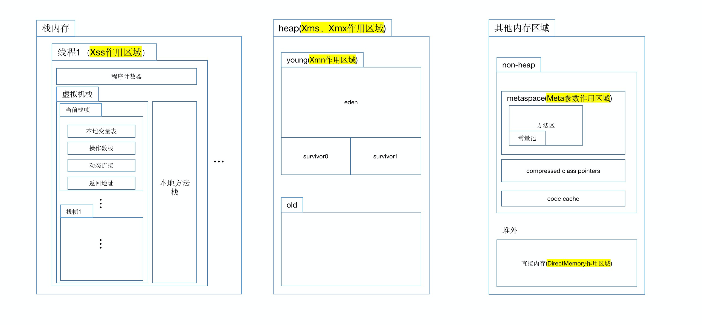
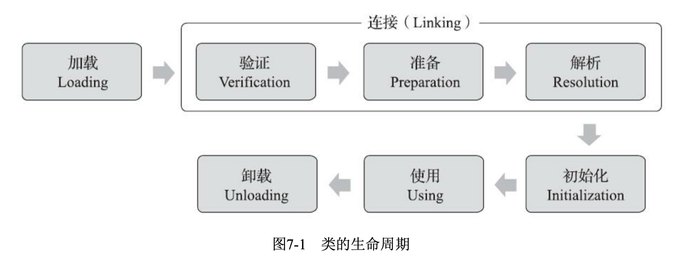

[TOC]

# JVM个人总结

## 为什么需要JVM？

jvm解决C/C++编程时，程序员的两大苦恼：

	* 需要在代码中直接管理内存
	* 需要针对不同操作系统平台进行编译的效率问题。

## JVM的核心原理

### 自动内存管理

#### 运行时内存区域 

特别说明：

1. 动态连接的作用

    指向运行时常量池中当前栈帧所属方法的引用

2. 返回地址的作用

    返回到父方法的地址，一般是程序计数器的值。

3. 压缩类指针的作用

4. 代码缓存的作用

5. metaspace就是hotspot对JVM规范方法区的实现

#### 对象可被回收的判断算法

GCRoot的可达性分析。

GCRoot有：

* 虚拟机栈的本地变量表引用的对象。
* 方法区（metaspace）的静态变量引用的对象
* 方法区常量引用的对象
* 本地方法栈的本地变量表引用的对象
* Java虚拟机内部的引用，如基本数据类型对应的Class对象，一些常驻的异常对象(比如
    NullPointExcepiton、OutOfMemoryError)等，还有系统类加载器。
* synchronized持有的对象
* 反映Java虚拟机内部情况的JM XBean、JVM TI中注册的回调、本地代码缓存等。

#### 垃圾收集算法

分代收集理论

标记-清除

​	优点：少量对象需要回收时效率高，暂停时间短

​	缺点：1、大量对象时效率低

​				2、容易产生内存碎片，导致内存分配失败次数增加和垃圾收集频繁

标记-复制

​	优点：解决了清除算法的内存碎片问题。在需要回收大量对象时效率也高。

​	缺点：两个内存区域互相复制，浪费了一半内存空间				

标记-整理		

​	优点：不会有内存碎片，吞吐量大。

​	缺点：整理移动对象时需要stop the world，可能增加了虚拟机暂停时间。

#### JVM内置垃圾收集器

* Serial垃圾收集器

    **作用范围**：young区

    **算法**：复制

    **优点**：gc占用线程和内存较少，适用于小型应用。

    **缺点**：单线程gc效率低，导致暂停时间长，吞吐量低。

    **描述**：使用串行的gc策略，串行可以理解为gc线程为单线程，只能串行执行垃圾收集。意味着GC的效率比较低，吞吐量较低，暂时时间较长。但是由于算法简单，没有gc线程上下文切换等复杂机制，所以适用于极小堆内存的场景，比如小客户端程序。所以，JDK把Serial+Serial Old作为JVM client模式下的默认GC组合，Serial适用复制算法，Serial Old适用标记整理算法，分别执行年轻代和年老代的垃圾收集。

    **搭配**：Serial old

* Parallel scavenge 

    **作用范围**：young区

    **算法**：复制

    **优点**：多线程并行收集，服务吞吐量大。

    **缺点**：并行导致暂停时间相比并发收集的gc更长。

    **描述**：通过自身算法根据暂停时间目标和吞吐量目标动态调控gc策略。

    **搭配**：ps old JDK8默认

* Parallel Old

    **作用范围**：old区

    **算法**：标记整理

    **优点**：多线程并行收集，服务吞吐量大。

    **缺点**：并行导致暂停时间相比并发收集的gc更长，整理也会增加暂停时间。

    **描述**：通过自身算法根据暂停时间目标和吞吐量目标动态调控gc策略。

* parNew垃圾收集器

    **作用范围**：young区

    **算法**：复制

    **优点**：多线程并行收集

    **缺点**：与CMS搭配的算法较为落后，被G1等新的gc取代

    **描述**：serial的多线程版本

    **搭配**：cms

* CMS垃圾收集器

    **作用范围**：old区

    **算法**：并发的标记清除算法

    **优点**：最大暂停时间优先，省去了内存整理，执行效率高。

    **缺点**：容易产生内存碎片，退化为serialold，可能导致GC频繁。

    **描述**：将标记和清理分为多个阶段，只有初始标记和最终标记两个阶段需要STW，暂时时间较短。

* G1垃圾收集器

    **作用范围**：full

    **算法**：region分代回收、标记-整理

    **优点**：最大暂停时间优先，大内存时效果好

    **缺点**：算法较为复杂，垃圾回收器自身占用内存很多，小内存情况下可能不如cms或并行合适。

    **描述**：将堆内存分为多个region。

* ZGC

    

* Shenandoah 

    优点：同G1GC原理有很大相似，但垃圾回收过程更加复杂，暂停时间更低

    缺点：吞吐量相比CMS/G1/parallel更低

总结

* 如果是内存很小的客户端应用，可以使用serial组合的gc。
* 如果是内存不到4G，重停顿时间。可以尝试使用cms。
* 如果内存不大，重吞吐量，可以使用ps并行gc。
* 如果是6G以上的大内存，可以使用G1GC。
    * 如果是JDK13，oracleJDK可以使用ZGC，openJDK可以使用Shenandoah。
* 当然，不是一定的，要不断调整参数，依据压测结果，灵活选择。

### 字节码机制（编译、执行...）

#### 字节码加载：类加载机制

加载：将字节码流加载进内存。将类变量等加载进方法区。在堆中创建Class对象。

验证：对字节码格式进行校验。

准备： 为变量分配内存空间，执行类的静态默认初始化。

解析：将类中的方法、变量等符号引用转化为直接对象引用。

初始化：类的<cinit>。执行静态赋值初始化和静态代码块。

* 类加载时机

    调用静态方法、set、get静态变量

    启动调用main类

    new 对象

    HandleMethod

    反射调用类

    调子类，接口有default方法，会加载接口类

#### 类加载器

作用：通过类的全限定名获取类的二进制字节流。

作用时间：类加载机制的**加载**阶段。

双亲委派机制:

​	作用：保证java的底层基本类不会被上层新建的类加载覆盖

​	缺点：JDK底层代码无法加载用户/第三方库的类

​	破坏：JDBC、tomcat等

#### 执行：虚拟机执行子系统

* 虚拟机字节码执行时，运行时栈帧结构
* 方法的调用（静态解析和动态分派(多态的原理-invokevirtual指令)）
* JVM基于栈的字节码解释执行引擎

## JVM带来的问题一：需要掌握GC调优。

JVM采用通用的内存管理策略，可能在实际应用场景中出现不可预料的内存问题，所以需要掌握内部原理和GC调优经验

### 监控工具的使用

### 调优经验

## JVM带来的问题二：需要掌握字节码加载执行机制。

字节码机制使程序执行对程序员不透明，无法对程序原理了如指掌，实现代码性能、内存最优

### 对象的创建

### 对象的访问

