刚开始听这个平衡二叉树的旋转，一听就蒙了，后来看了很多视频，有很多的说法。下面来介绍平衡二叉树

平衡二叉树：就是每个节点的平衡因子(Balance Factor)(以下简称BF)的绝对值小于等于1，即为0或1。

而BF就是每个节点左子树的高度减去右子树的高度。

平衡二叉树的旋转共有四种情况：

下面说一个定义，新插入的节点为破坏点，而由于破坏点的存在使二叉树失衡(|BF|>1)的节点为被破坏节点

#### 1.LL型：即为被破坏节点的左子树的左子树插入破坏节点。如图：

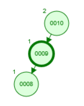

 

 数值为10的节点的左子树(数值为9的节点)的左子树(数值为8的节点)，使其不平衡，而10为被破坏节点，8为破坏节点，那么LL即为10的L的9的L，后一个L为中心，顺时针旋转10节点(右旋)，则得到：

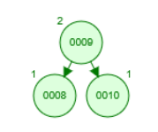

 

#### RR型：即为被破坏节点的右子树的右子树插入破坏节点。如图

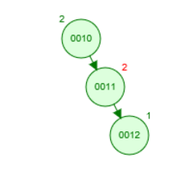

 

 数值为10的节点的右子树(数值为11的节点)的右子树(数值为12的节点)，使其不平衡，而10为被破坏节点，12为破坏节点，那么RR即为10的R的11的R，后一个R为中心，逆时针旋转10节点(左旋)，则得到：

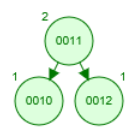

 

#### LR型：即为被破坏节点的左子树的右子树插入破坏节点。如图：

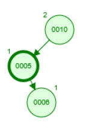

 

 无论怎么旋转发现一次都不能完成，则需先将其转化为LL型(因为LR型第一个为L，所以转化为LL型，再按上面的步骤进行旋转)，又因为LL为递减的顺序，所以6应该上去，5下来；

　　1.转化为LL型：

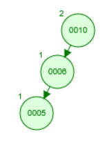

 

 这样就构成了LL型，按上面的步骤进行二次旋转

　　2.按LL型处理：

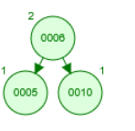

 

 #### RL型：即为被破坏节点的右子树的左子树插入破坏节点。如图：

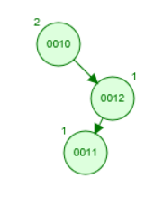

 

 

先将其转化为RR型，因为RR型，从上往下为递增，因此需要将11向上，12向下，从而构造成，RR型；

　　1.转化为RR型

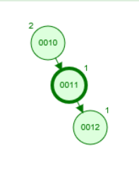

 

 　2.正常的RR旋转：

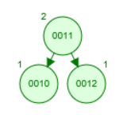

 

 

#### 其他复杂情况的通用处理方法

注意：

考试的题，二叉树会很复杂，也就是说你要正确的LR,RR,LL,RL对于哪个节点而言，这样你就会明白旋转的中心

旋转的操作都是对不平衡的最小子树，例如如果两个节点都不平衡，则先考虑深度大的节点，因为解决这个问题以后，可能深度小的也自然而然的解决了。

要解决旋转之后产生分支的何去何从，这是你要看分支在原图的位置，和其他点的大小关系，这样你就知道旋转之后，它要依附于哪个点

不管怎么操作都不能改变其中序遍历的顺序

 

认真的思考之后，不难发现，不论用什么方法，操作以后，都是让是三个点之中大小为中间的数做根，比中间数小的数，做根的左孩子，比中间数大的数，做根的右孩子，因此有一个简单的方法：

1.不管什么结构，从最深的叶子节点向上递归查找第一个失衡的点，标号为1.

2.再选1下面的点为2.

3.再选2下面的点为3.

4.不管什么结构，大小为中间的数做根，比中间数小的数，做根的左孩子，比中间数大的数，做根的右孩子

5.然后按照分支和每个点之间的关系，补全，这样就完成了。

 

例子：在如图所示的平衡二叉树中插入关键字48后得到一颗新的平衡二叉树，在新的平衡二叉树中，关键字37所在的节点的左右子节点中保存的关键字分别是：

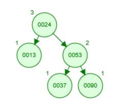

 插入48之后如图：

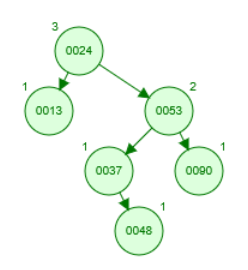

 从下到上计算每个节点的BF；

BF(48)=0;　　　　BF(37)=-1;　　　　BF(90)=0;　　　　BF(53)=1;　　　　BF(13)=0;　　　　BF(24)=-2;

发现失衡节点为24，那么24编号为1，又因为插入了48(所以造成失衡的路径应为24->53->37->48)，所以2号节点为53，3号节点为37

将三个节点排序，则37为根节点，24为左孩子，53为右孩子，如图：

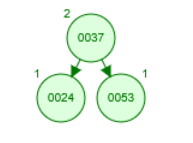

 再按原图的关系，补全图：53右孩子为90；49比37大比53小，所以48为53的右孩子；24的左孩子为13；如图：

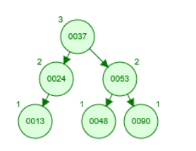

 

 可知答案为24 53；

> https://www.cnblogs.com/tkg1314/p/11997821.html

AVL: http://www.oschina.net/code/snippet_176897_14149

二叉查找树:  http://www.oschina.net/code/snippet_176897_14148

红黑树：http://www.oschina.net/code/snippet_176897_14155

 

SBT:  http://www.nocow.cn/index.php/SBT

AVL:  http://www.nocow.cn/index.php/AVL%E6%A0%91

Treap: http://www.nocow.cn/index.php/Treap

 

https://github.com/PeterRK/DSGO/blob/master/book/index.md

 

### 平衡二叉树的时间复杂度

插入，删除

设n为树内节点个数，h为树的高度，

树的各种操作的复杂度都依赖于树的高度，所有操作的复杂度均为O(h), h可能log(n)，也可能n

 

则普通的二叉查找树，操作复杂度均为log(n)，最坏情况可能O(n)，可以证明，随机构造的树的平均高度为log(n)，所以平均复杂度为log(n)。

 

AVL树保持每个结点的左子树与右子树的高度差至多为1，从而可以证明树的高度为O(log(n))。

Insert操作与delete操作的复杂度均为log(n)，旋转操作可能会达到log(n)次

 

红黑树赋予了树一定的性质，从而在保持这些性质的同时，能保证树的高度为log(n)。

性质中如：节点有红黑2色，其中路径中黑结点数目相同。红节点的2个子结点均为黑，根节点为黑，NIL节点为黑。

 

红黑树的insert操作，在最普通的insert()后，调用insert_fixup()来保持树的节点的性质。

Insert()的复杂度log(n),insert_fixup()复杂度也为log(n),另外insert_fixup()里可能有旋转操作，不过至多进行2次，每次复杂度均为O(1)

代码中一共3种情形，除了case1可能调用log(n)次，其它2种情况最多执行1次。

 

红黑树的delete操作，同样在正常的delete()操作后，调用delete_fixup()来保持节点的性质。

delete ()的复杂度log(n), delete_fixup()复杂度也为log(n),另外delete_fixup()里可能有旋转操作，不过至多进行3次，每次复杂度均为O(1)

代码一共4种情形，除了case2可能循环log(n)次，其它3种情况最多执行1次。

 

Treap树堆，保证是树的同时又是一个堆，可以证明树堆的期望复杂度为log(n), 因此所有操作的期望复杂度也为log(n)。

#### 红黑树与AVL的区别

1. AVL以及红黑树是高度平衡的树数据结构。它们非常相似，真正的区别在于在任何添加/删除操作时完成的旋转操作次数。
2. 两种实现都缩放为a O(lg N)，其中N是叶子的数量，但实际上AVL树在查找密集型任务上更快：利用更好的平衡，树遍历平均更短。另一方面，插入和删除方面，AVL树速度较慢：需要更高的旋转次数才能在修改时正确地重新平衡数据结构。
3. 在AVL树中，从根到任何叶子的最短路径和最长路径之间的差异最多为1。在红黑树中，差异可以是2倍。
4. 两个都给O（log n）查找，但平衡AVL树可能需要O（log n）旋转，而红黑树将需要最多两次旋转使其达到平衡（尽管可能需要检查O（log n）节点以确定旋转的位置）。旋转本身是O（1）操作，因为你只是移动指针。