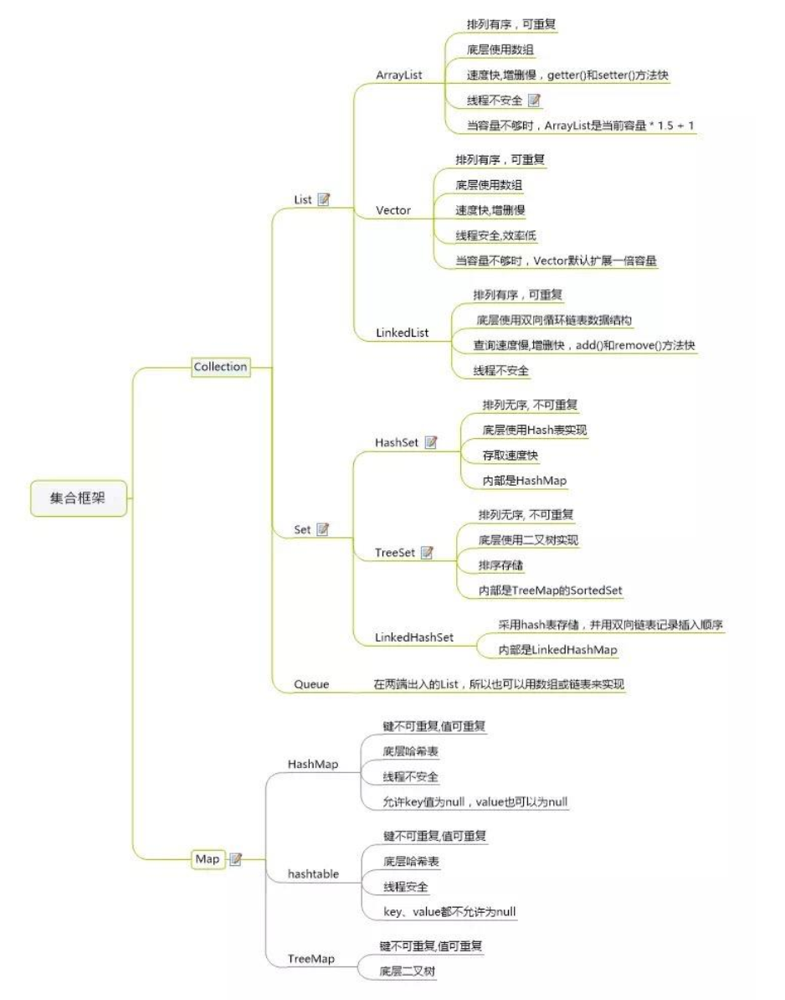

### 集合特性总结



### HashMap

#### hash函数：

**如何通过元素的hashcode值将元素放到hashMap的存储数组中的位置？**

hashcode()方法返回的是一个int，数值范围在-21-+21亿，绝大多数场景下HashMap不会存储这么多数据，所以可以通过hashCode对数组大小取余的方式，确定元素在数组中的位置。但是考虑到取余运算的性能，可以将数组的大小N限定为2的N次幂，这样hashcode对N取余就等同于hashcode&(N-1)。

这也是hashmap采用*2的扩容策略的原因。

**那为什么hash方法中最终hashcode要(h = key.hashCode()) ^ (h >>> 16)？**

因为采用取余作为hash算法有一个缺点：差为容量N的等差数列对N取余的结果都相同，此时hash冲突严重。为了解决这个问题，我们可以采用高位移位到低位，和低位进行异或运算，目的是让高16位也参与到最终取模位置的计算。（这里为什么采用异或而不是与和或？ 与运算将结果趋近于0（取模结果容易集中在数组前小部分碰撞），或运算让结果趋近于1（取模结果容易集中在数组后小部分碰撞），只有异或结果1、0的概率相等，让元素取模后的位置足够松散，减少碰撞 ）

hash源码：

```
static final int hash(Object key) {
	int h;
	return (key == null) ? 0 : (h = key.hashCode()) ^ (h >>> 16);
}
```

#### 根据源码详解HashMap中的数组、链表、红黑树变化

putVal源码：

```
final V putVal(int hash, K key, V value, boolean onlyIfAbsent,
                   boolean evict) {
        Node<K,V>[] tab; Node<K,V> p; int n, i;
        if ((tab = table) == null || (n = tab.length) == 0)
        	//如果数组为空，则扩容 table是实际存储KV的数组，n是数组容量
            n = (tab = resize()).length;
        //这里可以看到确定元素在hashMap数组中的位置的方法是 hash值&(当前容量-1)：因为容量每次扩容都是*2，保证一直是2的n次幂，所以&运算等价于hash值对容量取余。
        if ((p = tab[i = (n - 1) & hash]) == null)
        	//hash对数组容量取余，如果数组这个位置没有元素，则放入数组这个位置
            tab[i] = newNode(hash, key, value, null);
        else {
        	//如果这个位置已经有元素了
            Node<K,V> e; K k;
            if (p.hash == hash &&
                ((k = p.key) == key || (key != null && key.equals(k))))
                //如果要put的key与数组这个位置已有的key == 或者 equals 则直接e=数组已有的这个Node
                e = p;
            else if (p instanceof TreeNode)
            	//equal不等且当前元素是一个红黑树节点，则把这个元素放入树中
                e = ((TreeNode<K,V>)p).putTreeVal(this, tab, hash, key, value);
            else {
            	//equal不等且数组当前位置元素是链表
                for (int binCount = 0; ; ++binCount) {
                    if ((e = p.next) == null) {
                    	//追加到链表尾部
                        p.next = newNode(hash, key, value, null);
                        if (binCount >= TREEIFY_THRESHOLD - 1) // -1 for 1st
                        //如果链表长度超过8则将链表变为红黑树
                        //treeifyBin方法内部还会判断数组容量>=64才构造红黑树
                            treeifyBin(tab, hash);
                        break;
                    }
                    if (e.hash == hash &&
                        ((k = e.key) == key || (key != null && key.equals(k))))
                        break;
                    p = e;
                }
            }
            if (e != null) { // existing mapping for key
                V oldValue = e.value;
                if (!onlyIfAbsent || oldValue == null)
                	//用新的value覆盖
                    e.value = value;
                afterNodeAccess(e);
                return oldValue;
            }
        }
        ++modCount;
        if (++size > threshold)
        	//判断达到threshold则扩容
            resize();
        afterNodeInsertion(evict);
        return null;
    }
```

#### ConcurrentHashMap

解决HashMap线程不安全，导致并发put链表循环的问题。

JDK1.7

​	原理：基于分段锁segment数组(segment extends reetrantLock)+链表实现。

​	默认16个segment，每个segment里持有一部分entry数组。

JDK1.8

​	原理：基于CAS+synchronize实现。结构和1.8的HashMap一致：数组+链表、红黑树跳转策略相同

​	如果给定hash位没有元素，则CAS放置元素。如果有，在扩容则协助扩容，没在扩容则synchronized锁住，然后写入链表或红黑树。

​	1.8比1.7性能好，减少了锁的粒度，增加了红黑树，优化了性能。


#### LinkedHashMap

使用链表维护元素的顺序。

链表可以配置按访问顺序或插入顺序。

配合重写removeEldestEntry方法，按访问顺序可以实现LRUcache。

#### HashSet

使用装饰器模式，装饰了HashMap。元素对应HashMap的key

#### Hashtable

key、value都不能为null。

hash算法简单，如下，容易产生哈希冲突

```
int index = (hash & 0x7FFFFFFF) % tab.length;
```

产生冲突时采用链表，冲突则放入链表头部。

使用synchronized保证线程安全

#### TreeMap

底层红黑树

key必须实现java.lang.Comparable，通过比较器的结果，确定元素在树中的位置。

#### TreeSet

装饰TreeMap实现。


